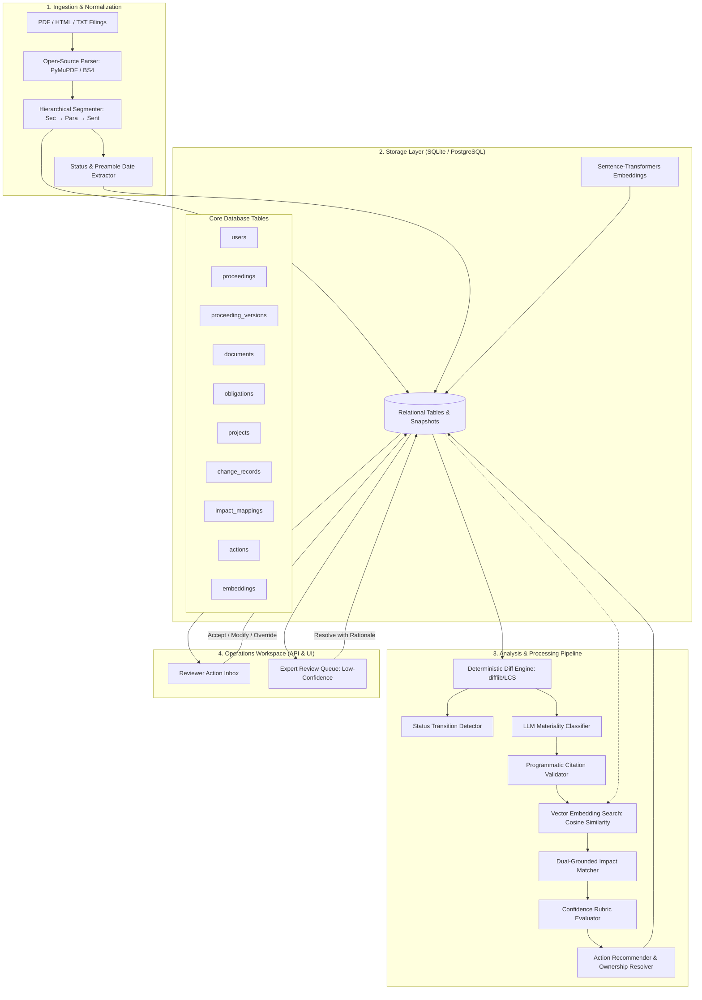
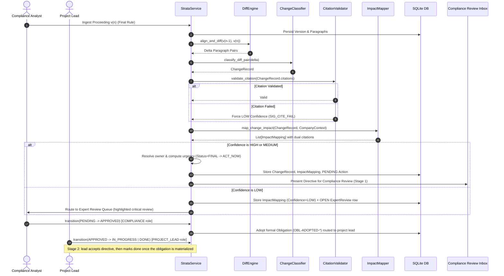

# Strata — Technical Design Document (TDD)

**A citation-grade regulatory intelligence and operations workspace for regulated enterprises**

Version: 1.3 · Status: Approved MVP Technical Design · Companion to `Strata_PRD.md`

---

## 1. System Overview & Design Principles

### 1.1 Overview & Scope
Regulated enterprises face a continuous influx of regulatory proceedings (dockets, NPRMs, revised drafts, final orders) that affect internal obligations, governing documents (policies, SOPs, contracts), and capital projects. 

Strata is a **change-to-action workspace** that ingests regulatory proceedings and enterprise context, computes deterministic diffs, extracts verifiable citations, maps impacts to company assets via dense embeddings, and routes actionable tasks to owners under a clear operational review lifecycle.

### 1.2 Non-Negotiable Engineering Principles
1. **Citation-First, Not Summary-First**: Every claim (detected change, mapped impact, or recommended action) is anchored to an addressable character span verified deterministically against immutable snapshots before display.
2. **Deterministic Diff, Probabilistic Interpretation**: Mechanical text deltas are calculated using sequence alignment algorithms (`difflib`/LCS). LLMs are employed exclusively for bounded interpretation: classifying materiality and extracting regulatory rationale.
3. **Structured Review Lifecycle**: Action directives progress through a persona-owned two-stage lifecycle (`PENDING` → `APPROVED` → `IN_PROGRESS`/`DONE`, or `REJECTED`). Human modifications record explicit rationale, preserve the original directive, and return the item to compliance review.
4. **Confidence Gates Action**: A transparent multi-signal rubric governs confidence. Low-confidence or ambiguous items are structurally blocked by the state machine from creating pending operational actions and route exclusively to an Expert Review Queue.
5. **Canonical Addressability**: Ingested proceedings and internal documents are parsed into a uniform coordinate tree (`doc_id → version_id → section_id → para_id → sentence_id → char_span`). Citations are stable, resolvable pointers.

### 1.3 MVP Scoping: Local-First Baseline
For the initial MVP build, the system is strictly scoped to a **local-first, self-contained architecture**:
- **Zero Cloud Infrastructure**: Operates on a local SQLite database (`strata.db`) and local Python runtime.
- **Reproducible & Deterministic**: Runs fully offline with deterministic diffing and local/embedded vector stores, eliminating external cloud dependency risks or cold-start network latency during initial demonstration and evaluation.
- **Cloud Readiness**: Storage abstractions and service APIs are decoupled, enabling drop-in migration to cloud serverless or container platforms post-MVP.

---

## 2. High-Level Architecture

### 2.1 Architecture Diagram



### 2.2 Subsystem Responsibilities

| Subsystem | Key Components | Core Responsibility |
|---|---|---|
| **Ingestion** | `DocumentExtractor`, `DocumentSegmenter`, `MetadataExtractor` | Extracts clean text from PDF/HTML, generates addressable hierarchy with character spans, and extracts status (`DRAFT`, `PROPOSED`, `FINAL`). |
| **Storage** | `Database`, `StrataRepository` | Manages relational tables in SQLite (`strata.db`) with foreign key constraints. |
| **Analysis Pipeline** | `DiffEngine`, `CitationValidator`, `ChangeClassifier` | Aligns paragraph sequences, validates verbatim quotations against snapshots, and classifies change types/materiality. |
| **Impact & Routing** | `VectorStore`, `ImpactMapper`, `ConfidenceRubric`, `ActionRouter` | Uses dense embeddings to retrieve candidate enterprise assets, evaluates confidence signals, and deterministically resolves owners and urgency. |
| **Workspace UI** | React + Vite (`frontend/`) & FastAPI Static | Modern Single-Page Application (SPA) built with React 19, TypeScript, and Vite, providing visual diff inspection, action management, and expert escalation review. |

### 2.3 Workspace UI Architecture & React Component Hierarchy

The frontend is implemented as a modern, reactive single-page application (SPA) built with **React, TypeScript, and Vite** (located in `frontend/`), designed to run independently in development (`npm run dev` with Vite proxying to FastAPI `:8000`) or built into optimized production assets (`dist/`) served directly by the backend:

1. **State Management & Data Layer**:
   - Asynchronous query cache and optimistic mutation hooks querying the FastAPI REST endpoints (`/proceedings`, `/projects`, `/obligations`, `/actions`, `/analyze`).
   - Active proceeding context and filter state maintained in reactive application state.

2. **Component Hierarchy**:
   - `App`: Main layout shell with persistent Header and navigation tab switcher.
   - `Header`: Active proceeding dropdown (`FERC-RM22-14` vs `EPA-NSPS-KKKK`), dynamic status badge (`FINAL RULE` in emerald, `PROPOSED` in amber), LLM backend indicator, and live analysis trigger.
   - `DashboardView`: Executive metric cards (Active Projects, Obligations, Material Changes, Escalations) and asset summary cards.
   - `ChangeDiffViewer`: Dual-column comparative citation viewer rendering before/after quoted spans with exact character highlights, confidence tiers, and embedded action decision controls.
   - `ActionInbox`: Compliance Review Inbox (Stage 1) filtering directives by lifecycle state (`PENDING`, `APPROVED`, `IN_PROGRESS`, `DONE`, `REJECTED`) with owner attribution chips.
   - `HumanOverrideModal`: Accessible modal capturing non-destructive modified directives.
   - `ExpertReviewQueue`: Gated workflow for low-confidence items with trigger signal chips (`SIG_AMBIG_TERM`, `SIG_CITE_FAIL`) and inline resolution actions.

3. **Styling & Design System**:
   - Curated dark mode theme with glassmorphic depth, crisp typography (`Inter`, `JetBrains Mono`), and semantic status colors:
     - Emerald (`#10b981`): Final Rule / Verified Citations / High Confidence
     - Amber (`#f59e0b`): Proposed Rules / Monitor Urgency / Pending Overrides
     - Rose/Red (`#ef4444`): Escalated Items / Low Confidence / Material Alerts
     - Indigo/Violet (`#6366f1`): Active Brand / Primary Interactive Controls

---

## 3. Data Pipeline & Subsystem Details

### 3.1 Ingestion & Canonical Addressing
- **Open-Source Text Extractors**:
  - `PyMuPDF` (`fitz`): Page-by-page text block extraction for regulatory orders and dockets, stripping running headers/footers.
  - `BeautifulSoup4`: DOM traversal and boilerplate removal for HTML filings (Federal Register, web dockets).
  - Regex text normalizer for plain text and Markdown.
- **Canonical Address Tree**:
  - `Section`: Heading title and structural identifier (`sec_1`).
  - `Paragraph`: Discrete narrative and atomic change unit (`sec_1_p1`) with `char_span: [start, end]`.
- **Status Classification Pass**:
  - Identifies `status` (`DRAFT`, `PROPOSED`, `FINAL`, `WITHDRAWN`) and filing/effective dates from preamble markers.

### 3.2 Change Detection & Status Transition
1. **Paragraph Sequence Alignment**:
   - Uses `difflib.SequenceMatcher` over paragraph token streams between `ProceedingVersion(n-1)` and `ProceedingVersion(n)`.
   - Produces discrete change deltas: `ADDED`, `MODIFIED`, or `REMOVED`.
2. **Materiality & Change Classification**:
   - Evaluates whether the diff represents a substantive shift: `NEW_REQUIREMENT`, `DEADLINE_SHIFT`, `SCOPE_CHANGE`, `REQUIREMENT_REMOVED`, or `DEFINITION_CHANGE`. Non-substantive formatting edits are marked `IMMATERIAL`.
3. **Programmatic Citation Validation**:
   - Code check asserts that claimed `quoted_text` is an exact (or normalized-whitespace) substring of the referenced paragraph.
   - **Fail-Safe Gate**: Failed citations are not discarded; they are demoted to `confidence = LOW` (`SIG_CITE_FAIL`) and enqueued for Expert Review.
4. **Status Transition Detection**:
   - Any shift in proceeding status (e.g., `PROPOSED → FINAL`) immediately emits a high-salience `STATUS_TRANSITION` change record.
5. **Expert Review Persistence**:
   - Every escalated item is persisted to the `expert_reviews` table (status `OPEN`), so the queue survives analysis re-runs and page reloads.
   - Counsel resolution records decision + reviewer + rationale. Confirming decisions release the underlying mapping to the compliance review inbox as a `PENDING` action; dismissals close the item with no operational task.

### 3.3 Semantic Retrieval & Dual-Grounded Impact Mapping
1. **Embedding Search**:
   - Dense embeddings (`sentence-transformers/all-MiniLM-L6-v2`, 384 dimensions) represent company obligations, projects, and internal policy sections.
   - The query vector is formed from `ChangeRecord.description + "\n" + after_citation.quoted_text`.
   - Cosine similarity retrieves top-$k$ candidate assets (excluding external proceeding text).
2. **Dual-Citation Grounding**:
   - Every confirmed mapping must carry verifiable citations on both sides:
     - `change_citation`: Specific quoted span from the regulatory proceeding.
     - `affected_citation`: Verbatim quoted span from the internal obligation, project scope, or document.
3. **Many-to-Many Propagation**:
   - If an internal document (e.g., SOP or permit) is impacted, all compliance obligations linked to that document are automatically linked.

### 3.4 Action Routing & Urgency Business Logic
1. **Deterministic Ownership Resolution**:
   - The model recommends *what* action to take; the system deterministically looks up *who* owns the affected asset via `owner_id`.
2. **Deterministic Urgency Rules**:
   - `status == DRAFT` or `PROPOSED` → Urgency set to `MONITOR`.
   - `status == FINAL` → Urgency set to `ACT_NOW`.
   - `STATUS_TRANSITION` to `FINAL` → Urgency set to `ACT_NOW`.
   - (`ACT_SOON` is reserved for deadline-aware urgency once explicit deadline extraction lands; currently `MONITOR`/`ACT_NOW` only.)
3. **Two-Stage Action Lifecycle States** (persona-owned, enforced by the service-layer state machine):
   - **Stage 1 — Compliance Review**: `PENDING → APPROVED` (accept & adopt obligation) | `PENDING → REJECTED`.
   - **Stage 2 — Project Execution**: `APPROVED → IN_PROGRESS` (lead accepts) | `APPROVED → DONE` (direct completion) | `IN_PROGRESS → DONE`.
   - Any human modification of the directive text (mandatory rationale, original text preserved) returns the item to `PENDING` compliance review.
   - Compliance approval (`APPROVED`) materializes the directive as a formal enterprise obligation (`OBL-ADOPTED-*`) owned by the affected asset's owner.

### 3.5 Confidence Rubric & Expert Review Gating
Confidence is evaluated against an auditable, multi-signal rules engine:

| Signal | Condition | Confidence Effect | System Action |
|---|---|---|---|
| `SIG_CITE_FAIL` | Quoted span failed programmatic substring verification | Force `LOW` | Enqueue in Expert Review Queue |
| `SIG_AMBIG_TERM` | Undefined statutory phrasing detected (e.g., *"ancillary emergency asset"*) | Force `LOW` | Enqueue in Expert Review Queue |
| `SIG_RANK_TIE` | Top candidate enterprise assets score within 3% retrieval margin | Cap at `MEDIUM` | Advisory flag in Reviewer Inbox |
| `SIG_HIGH_STAKES` | Change alters statutory deadlines, civil penalties, or applicability scope | Cap at `MEDIUM` | Heightened Review Flag |
| `SIG_CLEAN_GROUND`| Citations verified, single distinct match, unambiguous legal text | Eligible for `HIGH` | Standard Action Inbox |

- **Structural Blocking**: Low-confidence items are structurally blocked from generating actionable operational tasks until resolved by an expert reviewer with recorded rationale.

---

## 4. Data Model & Database Architecture

### 4.1 Canonical Data Schema

```
Proceeding (id, docket_id, title, jurisdiction)
 └── ProceedingVersion (id, proceeding_id, version_label, status, filed_date, effective_date, raw_text)
      └── Section (section_id, heading)
           └── Paragraph (para_id, text, char_span: [start, end])

CompanyContext:
 ├── User (id, name, email, role: COMPLIANCE | PROJECT_LEAD | ADMIN)
 ├── Document (id, title, doc_type: POLICY | PROCEDURE | CONTRACT | FILING, owner_id, raw_text, sections)
 ├── Obligation (id, description, owner_id, status: ACTIVE | SUPERSEDED | CLOSED, linked_doc_id)
 └── Project (id, name, description, owner_id, status, linked_obligations, milestones)

Analysis & Living State:
 ├── ChangeRecord (id, proceeding_id, from_version_id, to_version_id, change_type, materiality, description, before_citation, after_citation, confidence, confidence_signals)
 ├── ImpactMapping (id, change_id, affected_type: OBLIGATION | PROJECT | DOCUMENT, affected_id, rationale, change_citation, affected_citation, confidence)
 ├── ActionRecommendation (id, mapping_id, recommended_action, suggested_owner_id, urgency: MONITOR | ACT_SOON | ACT_NOW,
 │                          state: PENDING | APPROVED | IN_PROGRESS | REJECTED | DONE,
 │                          original_action, override_rationale, updated_by, state_note)
 └── ExpertReview (id, change_id, mapping_id, change_description, signals, status: OPEN | RESOLVED,
                   decision, reviewer_id, rationale, created_at, resolved_at)
```

### 4.2 Relational Database Schema (SQLite DDL)

```sql
-- Core Relational Tables
CREATE TABLE users (
    id TEXT PRIMARY KEY,
    name TEXT NOT NULL,
    email TEXT UNIQUE NOT NULL,
    role TEXT CHECK(role IN ('COMPLIANCE', 'PROJECT_LEAD', 'ADMIN')) NOT NULL,
    created_at TIMESTAMP DEFAULT CURRENT_TIMESTAMP
);

CREATE TABLE proceedings (
    id TEXT PRIMARY KEY,
    docket_id TEXT UNIQUE NOT NULL,
    title TEXT NOT NULL,
    jurisdiction TEXT NOT NULL,
    created_at TIMESTAMP DEFAULT CURRENT_TIMESTAMP
);

CREATE TABLE proceeding_versions (
    id TEXT PRIMARY KEY,
    proceeding_id TEXT NOT NULL REFERENCES proceedings(id) ON DELETE CASCADE,
    version_label TEXT NOT NULL,
    status TEXT CHECK(status IN ('DRAFT', 'PROPOSED', 'FINAL', 'WITHDRAWN')) NOT NULL,
    filed_date DATE NOT NULL,
    effective_date DATE,
    comment_due_date DATE,
    raw_text TEXT NOT NULL,
    parsed_sections_json TEXT NOT NULL,
    created_at TIMESTAMP DEFAULT CURRENT_TIMESTAMP
);

CREATE TABLE documents (
    id TEXT PRIMARY KEY,
    title TEXT NOT NULL,
    doc_type TEXT CHECK(doc_type IN ('POLICY', 'PROCEDURE', 'CONTRACT', 'FILING')) NOT NULL,
    owner_id TEXT NOT NULL REFERENCES users(id),
    current_version INTEGER DEFAULT 1,
    raw_text TEXT NOT NULL,
    parsed_sections_json TEXT NOT NULL,
    created_at TIMESTAMP DEFAULT CURRENT_TIMESTAMP
);

CREATE TABLE obligations (
    id TEXT PRIMARY KEY,
    description TEXT NOT NULL,
    owner_id TEXT NOT NULL REFERENCES users(id),
    status TEXT CHECK(status IN ('ACTIVE', 'SUPERSEDED', 'CLOSED')) DEFAULT 'ACTIVE',
    linked_doc_id TEXT REFERENCES documents(id),
    source_citation_json TEXT,
    created_at TIMESTAMP DEFAULT CURRENT_TIMESTAMP
);

CREATE TABLE projects (
    id TEXT PRIMARY KEY,
    name TEXT NOT NULL,
    description TEXT NOT NULL,
    owner_id TEXT NOT NULL REFERENCES users(id),
    status TEXT CHECK(status IN ('ACTIVE', 'COMPLETED', 'ON_HOLD')) DEFAULT 'ACTIVE',
    milestones_json TEXT,
    created_at TIMESTAMP DEFAULT CURRENT_TIMESTAMP
);

CREATE TABLE project_obligations (
    project_id TEXT NOT NULL REFERENCES projects(id) ON DELETE CASCADE,
    obligation_id TEXT NOT NULL REFERENCES obligations(id) ON DELETE CASCADE,
    PRIMARY KEY (project_id, obligation_id)
);

CREATE TABLE change_records (
    id TEXT PRIMARY KEY,
    proceeding_id TEXT NOT NULL REFERENCES proceedings(id),
    from_version_id TEXT REFERENCES proceeding_versions(id),
    to_version_id TEXT NOT NULL REFERENCES proceeding_versions(id),
    change_type TEXT NOT NULL,
    materiality TEXT CHECK(materiality IN ('MATERIAL', 'IMMATERIAL')) NOT NULL,
    description TEXT NOT NULL,
    before_citation_json TEXT,
    after_citation_json TEXT,
    confidence TEXT CHECK(confidence IN ('HIGH', 'MEDIUM', 'LOW')) NOT NULL,
    confidence_signals_json TEXT,
    confidence_rationale TEXT,
    detected_at TIMESTAMP DEFAULT CURRENT_TIMESTAMP
);

CREATE TABLE impact_mappings (
    id TEXT PRIMARY KEY,
    change_id TEXT NOT NULL REFERENCES change_records(id) ON DELETE CASCADE,
    affected_type TEXT CHECK(affected_type IN ('OBLIGATION', 'PROJECT', 'DOCUMENT')) NOT NULL,
    affected_id TEXT NOT NULL,
    rationale TEXT NOT NULL,
    change_citation_json TEXT NOT NULL,
    affected_citation_json TEXT NOT NULL,
    confidence TEXT CHECK(confidence IN ('HIGH', 'MEDIUM', 'LOW')) NOT NULL,
    confidence_signals_json TEXT,
    created_at TIMESTAMP DEFAULT CURRENT_TIMESTAMP
);

CREATE TABLE actions (
    id TEXT PRIMARY KEY,
    mapping_id TEXT NOT NULL REFERENCES impact_mappings(id) ON DELETE CASCADE,
    recommended_action TEXT NOT NULL,
    suggested_owner_id TEXT NOT NULL REFERENCES users(id),
    urgency TEXT CHECK(urgency IN ('MONITOR', 'ACT_SOON', 'ACT_NOW')) NOT NULL,
    state TEXT CHECK(state IN ('PENDING', 'APPROVED', 'IN_PROGRESS', 'REJECTED', 'DONE')) DEFAULT 'PENDING',
    original_action TEXT,
    override_rationale TEXT,
    updated_by TEXT,
    state_note TEXT,
    created_at TIMESTAMP DEFAULT CURRENT_TIMESTAMP,
    updated_at TIMESTAMP DEFAULT CURRENT_TIMESTAMP
);

-- Expert Review Queue (persisted low-confidence escalations & determinations)
CREATE TABLE expert_reviews (
    id TEXT PRIMARY KEY,
    change_id TEXT,
    mapping_id TEXT,
    change_description TEXT NOT NULL,
    signals_json TEXT,
    status TEXT CHECK(status IN ('OPEN', 'RESOLVED')) DEFAULT 'OPEN',
    decision TEXT,
    reviewer_id TEXT,
    rationale TEXT,
    created_at TIMESTAMP DEFAULT CURRENT_TIMESTAMP,
    resolved_at TIMESTAMP
);

-- Vector Embeddings Table
CREATE TABLE embeddings (
    id TEXT PRIMARY KEY,
    entity_type TEXT CHECK(entity_type IN ('PROCEEDING_PARA', 'DOC_PARA', 'OBLIGATION', 'PROJECT')) NOT NULL,
    entity_id TEXT NOT NULL,
    chunk_id TEXT NOT NULL,
    chunk_text TEXT NOT NULL,
    embedding_blob BLOB NOT NULL
);
```

### 4.3 Relational Entity Persistence
- Core domain entities (proceedings, versions, paragraphs, documents, obligations, projects, change records, impact mappings, and actions) are stored in SQLite relational tables with foreign keys and cascaded deletions.
- State transitions, human overrides, and expert review determinations update active records directly with transition timestamps and audit-defensible rationales.

### 4.4 State Machines & Lifecycle Transitions

Strata governs compliance operations through three interconnected state machines:

```mermaid
stateDiagram-v2
    direction LR
    
    subgraph Regulation_Lifecycle["1. Regulation Proceeding"]
        DRAFT --> PROPOSED: Notice of Proposed Rulemaking (NOPR)
        PROPOSED --> FINAL: Commission / Agency Final Order
        PROPOSED --> WITHDRAWN: Struck Down / Abandoned
    end

    subgraph Action_Lifecycle["2. Two-Stage Routed Operational Action"]
        state "Stage 1 · Compliance Review" as stage1 {
            PENDING --> APPROVED: Compliance Accepts & Adopts Obligation
            PENDING --> REJECTED: Compliance Rejects (terminal)
            PENDING --> PENDING: Modify w/ Mandatory Rationale
        }
        state "Stage 2 · Project Execution" as stage2 {
            APPROVED --> IN_PROGRESS: Project Lead Accepts Directive
            APPROVED --> DONE: Lead Marks Done (direct)
            IN_PROGRESS --> DONE: Lead Marks Done (materialized)
            APPROVED --> PENDING: Lead Modify → re-review
            IN_PROGRESS --> PENDING: Lead Modify → re-review
        }
        stage1 --> stage2
    end

    subgraph Project_Lifecycle["3. Enterprise Capital Project"]
        PLANNED --> ACTIVE: EPC & Interconnection Commenced
        ACTIVE --> SUSPENDED: Regulatory Injunction / Bottleneck
        SUSPENDED --> ACTIVE: Compliance Deficiency Resolved
        ACTIVE --> COMPLETED: Facility Commissioned & COD
    end

    Regulation_Lifecycle --> Action_Lifecycle: Status=FINAL elevates Urgency to ACT_NOW
    Action_Lifecycle --> Project_Lifecycle: Approved directives materialize as obligations; completed actions advance project milestones
```

**Persona ownership of transitions (enforced in `StrataService.transition_action_state`):**

| Transition | Required Role | Semantic |
|---|---|---|
| `PENDING → APPROVED` | `COMPLIANCE` | Directive passes compliance review; adopted as formal obligation and routed to the project lead |
| `PENDING → REJECTED` | `COMPLIANCE` | Directive dismissed as inapplicable/duplicative (terminal) |
| `APPROVED → IN_PROGRESS` | `PROJECT_LEAD` | Lead accepts the directive; work starts |
| `APPROVED → DONE` | `PROJECT_LEAD` | Obligation already materialized; lead closes directly |
| `IN_PROGRESS → DONE` | `PROJECT_LEAD` | Obligation materialized |
| *(any open state)* `→ PENDING` via override | `COMPLIANCE` (on PENDING) / `PROJECT_LEAD` (on APPROVED/IN_PROGRESS) | Directive text modified with mandatory rationale; re-enters compliance review |

`ADMIN` may perform any transition. Violations raise a 409 with the allowed transitions listed.

#### 4.4.1 Regulation Proceeding States (`ProceedingStatus`)
| State | Legal Character | Enterprise Action Posture | Action Urgency |
|---|---|---|:---:|
| **`DRAFT`** | Early agency staff concept / discussion paper | Non-binding; informational monitoring | `MONITOR` |
| **`PROPOSED`** | Published NOPR; public comments open | Active comment drafting, scenario modeling | `MONITOR` |
| **`FINAL`** | Adopted Final Order; legally binding | Mandatory milestone updates & engineering changes | **`ACT_NOW`** |
| **`WITHDRAWN`** | Docket cancelled, vacated, or superseded | Archive open monitoring tasks | `INFORMATIONAL` |

- **Transition Trigger**: Detected during ingestion when successive versions have differing status (e.g. `prev_ver.status != curr_ver.status`). Emits `STATUS_TRANSITION_DETECTED` and gates downstream urgency.

#### 4.4.2 Enterprise Capital Project States (`ProjectStatus`)
| State | Operational Definition | Regulatory Implication |
|---|---|---|
| **`PLANNED`** | Siting, environmental scoping, and interconnection queue filing. | Monitored against queue reforms and baseline environmental reviews. |
| **`ACTIVE`** | Active engineering design, procurement, and physical construction. | Directly subject to final emission limits, CEMS rules, and ride-through mandates. |
| **`SUSPENDED`** | Work halted due to permitting deficiency or interconnection delay. | Actions focus on clearing specific regulatory deficiencies. |
| **`COMPLETED`** | Commercial operation date (COD) achieved; energized. | Transitions to steady-state periodic compliance reporting. |

#### 4.4.3 Action Recommendation States (`ActionState`)
Two-stage, persona-owned lifecycle. A directive is never visible to the project lead until compliance approves it, and only the lead can complete it.

**Stage 1 — Compliance Review**
| State | Definition | Transition Mechanism |
|---|---|---|
| **`PENDING`** | System-recommended directive awaiting compliance review. | Created automatically when an impact mapping with High/Medium confidence is routed; or when a modified directive re-enters review. |
| **`APPROVED`** | Compliance accepted the directive; a formal obligation (`OBL-ADOPTED-*`) was adopted and the directive now appears in the project lead's execution inbox. | `POST /actions/{id}/transition?new_state=APPROVED` as a `COMPLIANCE` user. |
| **`REJECTED`** | Compliance dismissed the directive as inapplicable or duplicative (terminal). | `POST /actions/{id}/transition?new_state=REJECTED` with recorded rationale note. |

**Stage 2 — Project Execution**
| State | Definition | Transition Mechanism |
|---|---|---|
| **`IN_PROGRESS`** | Project lead accepted the directive; work underway. | `POST /actions/{id}/transition?new_state=IN_PROGRESS` as the assigned `PROJECT_LEAD`. |
| **`DONE`** | Physical or administrative compliance work completed; obligation materialized (terminal). | `POST /actions/{id}/transition?new_state=DONE` as the assigned `PROJECT_LEAD` (from `APPROVED` or `IN_PROGRESS`). |

**Modification loop (both stages):** any modification of the directive text via `POST /actions/{id}/override` requires a mandatory rationale, preserves the original text on the record (`original_action`, `override_rationale`, `updated_by`), and sets the state back to `PENDING` so compliance re-reviews it.

---

## 5. Core Interfaces & Execution Flow

### 5.1 End-to-End Pipeline Sequence



### 5.2 Strata Service API Contract (`StrataService`)

```python
class StrataService:
    def ingest_user(user_id: str, name: str, email: str, role: UserRole) -> User
    def ingest_proceeding_version(proceeding_id: str, version_label: str, file_path_or_content: str, ...) -> ProceedingVersion
    def ingest_document(doc_id: str, title: str, doc_type: str, owner_id: str, raw_text: str) -> InternalDocument
    def ingest_obligation(obl_id: str, description: str, owner_id: str, linked_doc_id: str) -> Obligation
    def ingest_project(proj_id: str, name: str, description: str, owner_id: str, linked_obligations: list[str]) -> Project
    
    def analyze_versions(proceeding_id: str, prev_version_id: str, curr_version_id: str) -> dict
    def list_expert_reviews(status: str = None) -> list[dict]
    def resolve_expert_review(target_id: str, reviewer_id: str, decision: str, rationale: str) -> dict
    def record_human_override(action_id: str, user_id: str, updated_action_text: str, override_rationale: str) -> ActionRecommendation
    def transition_action_state(action_id: str, user_id: str, new_state: ActionState, notes: str = "") -> ActionRecommendation
```

**Lifecycle & role enforcement (`transition_action_state`)**: the allowed transition table lives on the `ActionState` model (`allowed_transitions()`), mapping each `(from_state, to_state)` pair to the persona (`COMPLIANCE` / `PROJECT_LEAD`) that must perform it; `ADMIN` overrides all. Invalid states or wrong-role actors raise `TransitionError` (surfaced as HTTP 409 with the allowed transitions listed). Approving (`APPROVED`) adopts the formal obligation; overrides always return the directive to `PENDING` with `original_action` + `override_rationale` persisted.

---

## 6. Human Overrides & Operational Governance

### 6.1 Defensible Human Modifications
When a compliance officer or project lead modifies a directive:
1. The original recommendation text is preserved on the record (`original_action`) alongside the updated text.
2. The record stores:
   - `recommended_action`: The user's revised directive.
   - `override_rationale`: Mandatory explanation for why the system interpretation was adjusted.
   - `updated_by`: The acting user (role-attributed: compliance or project lead).
   - `state`: Reset to `PENDING` — every modification re-enters compliance review.
   - `updated_at`: Precise timestamp of human intervention.
3. Every human determination remains transparent and actionable directly within the enterprise workspace, and directives in terminal states (`DONE`, `REJECTED`) can no longer be modified.

---

## 7. Technology Stack

### 7.1 MVP Implementation Stack

| Layer | Component | Role in MVP |
|---|---|---|
| **Database** | SQLite (`strata.db`) | Relational entity storage with full foreign key constraints. Zero infrastructure setup. |
| **Document Parser** | `PyMuPDF` (`fitz`) & `BeautifulSoup4` | Open-source PDF text extraction (stripping running headers) and HTML DOM normalization. |
| **Embeddings** | `sentence-transformers/all-MiniLM-L6-v2` | Dense 384-dimensional vector embeddings for semantic asset retrieval via cosine similarity. |
| **Diffing Engine** | Python `difflib.SequenceMatcher` | Deterministic structural paragraph alignment without model hallucination risk. |
| **LLM Classification** | Claude 3.5 Sonnet / Gemini Flash | Schema-constrained materiality and change classification. |
| **Backend API** | FastAPI (Python 3.9+) | Lightweight REST service serving analysis, inboxes, and expert queues. |
| **Frontend SPA** | React 19 + TypeScript + Vite | Interactive regulatory operations workspace (inboxes, diff viewer, expert queue). |
| **Test Frameworks** | `behave` & `pytest` | Standard Cucumber/Gherkin BDD specifications and unit/integration quality gates. |

### 7.2 Production Evolution Path
- **Database**: PostgreSQL 16 with `pgvector` for combined SQL queries and high-throughput vector index scans.
- **Document Store**: S3-compatible WORM (Write Once, Read Many) object storage for raw regulatory filings.
- **Streaming & Event Store**: EventStoreDB or Kafka for multi-jurisdiction distributed docket streams.
- **Identity & RBAC**: SAML / OIDC enterprise SSO for role-based action routing and audit attribution.

### 7.3 Deployment Alternatives & Platform Evaluation

While the **local-first baseline is retained for the MVP**, the architecture maps cleanly to modern serverless and edge platforms:

1. **Cloudflare Edge Stack (Recommended Serverless Target)**:
   - **Database**: **Cloudflare D1** provides native serverless SQLite at the edge. The MVP schema runs on D1 without modifications.
   - **Vector Search & Embeddings**: **Cloudflare Vectorize** paired with **Workers AI** (`bge-small-en-v1.5`) executes embedding generation and similarity search natively at the edge without heavy Python/PyTorch dependencies.
   - **Document Storage**: **Cloudflare R2** (S3-compatible, zero egress fees) for immutable PDF/HTML snapshots.
   - **Workspace UI**: **Cloudflare Pages** for global edge hosting of the React/Vite frontend.

2. **Vercel Serverless Stack**:
   - **Frontend**: Native Next.js / React hosting on Vercel's edge network.
   - **Backend API**: Python Serverless Functions (`api/index.py` wrapping FastAPI).
   - **Storage Constraint**: Because Vercel functions have an ephemeral local disk (wiped between cold starts), a local `strata.db` file cannot persist state. To deploy on Vercel, the database must be backed by a serverless cloud database such as **Turso** (libSQL / SQLite over HTTP) or **Neon** (serverless Postgres).

3. **Containerized Cloud Stack (Zero Code Changes)**:
   - Platforms like **Fly.io**, **Railway**, or **Google Cloud Run** allow deploying the existing Python FastAPI container alongside a mounted persistent volume for `strata.db`, requiring zero architectural adaptations from the local MVP.

---

## 8. Verification & Testing Framework

### 8.1 Cucumber BDD Feature Specifications (`features/`)
Testing is driven by standard Gherkin feature files executed with `behave`:

1. **`change_detection.feature`**: Verifies paragraph diffing, status transition detection (`PROPOSED → FINAL`), and machine-verifiable citations across FERC Order 2023 versions.
2. **`impact_mapping.feature`**: Verifies embedding retrieval and dual-grounded citations mapping FERC inverter ride-through rules to the Desert Solar Project (`PROJ-SOLAR-DESERT-02`).
3. **`confidence_escalation.feature`**: Verifies that ambiguous statutory language in EPA NSPS Subpart KKKK (*"ancillary emergency generation asset"*) is demoted to `LOW` confidence, routed to the Expert Review Queue, and logged upon resolution.

### 8.2 Automated Quality Gates (`tests/`)
Pytest unit and integration test suite enforcing five quality gates:

```bash
PYTHONPATH=. pytest -v tests/
PYTHONPATH=. behave features/
```

| Gate | Test Module | Verification Assertion |
|---|---|---|
| **1. Citation Veracity** | `tests/test_citation_validator.py` | Exact/normalized substring validation passes; hallucinated quotes fail deterministically. |
| **2. Diff Determinism** | `tests/test_diff_engine.py` | Sequence alignment accurately detects paragraph additions, deletions, and modifications. |
| **3. Confidence Gating** | `tests/test_confidence_rubric.py` | `SIG_CITE_FAIL` and `SIG_AMBIG_TERM` force `LOW` confidence and trigger escalation. |
| **4. Relational Persistence** | `tests/test_database_and_events.py` | Relational tables preserve entity integrity, foreign keys, and status transitions. |
| **5. End-to-End Integration**| `tests/test_end_to_end.py` | Runs the full pipeline on real FERC and EPA regulations against the two enterprise test projects. |
| **6. Live LLM E2E** | `tests/test_live_llm_e2e.py` | Runs the complete pipeline with real model inference (Gemini, Claude, GPT-4o) and checks citations. |

### 8.3 Frontend UI Verification Suite (`frontend/src/test/`)

To validate that the interactive React workspace functions correctly and reliably reflects backend state, an automated component and integration test suite is implemented using **Vitest** and **React Testing Library**:

```bash
cd frontend && npm test
```

| UI Test Module | Verification Scope & Assertions |
|---|---|
| **`components.test.tsx`** | 1. **Header**: Renders logo, status chip (`FINAL RULE`), LLM indicator, and tests proceeding toggle.<br>2. **OverviewTab**: Validates metric card counts, capital project summaries, and compliance obligations.<br>3. **ChangeDiffViewer**: Asserts dual-column comparative citations with exact character highlights.<br>4. **ActionInbox**: Validates action directives, owner badges, and urgency filtering (`ACT_NOW` vs `MONITOR`).<br>5. **HumanOverrideModal**: Verifies modal opening, input of revised directive and mandatory rationale, and commit handling.<br>6. **ExpertReviewQueue**: Verifies low-confidence escalation display, trigger signal chips (`SIG_AMBIG_TERM`), and resolution prompts. |
| **`App.test.tsx`** | 1. **Full Workspace Navigation**: Validates seamless tab switching between Dashboard, Changes, Actions, and Expert Queue.<br>2. **Live Analysis Trigger**: Mocks API responses, executes "Run Live Analysis", verifies loading state, and confirms dynamic UI updates across all tabs. |

### 8.4 LLM Usages, Evaluation Benchmarks & GEPA Optimizer

To guarantee high model fidelity while preventing hallucination or prompt drift, every task delegated to an LLM in Strata is mapped to a programmatic evaluation benchmark with automated quality gates:

```
┌────────────────────────────────────────────────────────────────────────────────────────┐
│                                STRATA LLM EVALUATION MATRIX                            │
├──────────────────────────┬─────────────────────────────┬───────────────────────────────┤
│ LLM Usage Area           │ Evaluation Benchmark Suite  │ Automated Gate & Pass Metric  │
├──────────────────────────┼─────────────────────────────┼───────────────────────────────┤
│ 1. Materiality & Taxonomy│ MATERIALITY_BENCHMARK_CASES │ F1 Score > 0.85 on Material;  │
│    Classification        │ (6 curated FERC/EPA deltas) │ 100% accuracy on Deadlines    │
├──────────────────────────┼─────────────────────────────┼───────────────────────────────┤
│ 2. Citation Verbatim     │ CITATION_VERACITY_CASES     │ Hard Gate: 100% Exact         │
│    Span Extraction       │ (Zero-paraphrase test set)  │ Substring Match (0 tolerance) │
├──────────────────────────┼─────────────────────────────┼───────────────────────────────┤
│ 3. Dual-Grounding Impact │ IMPACT_GROUNDING_CASES      │ 100% Precision on asset link; │
│    Reasoning             │ (Project & Obligation pairs)│ Bidirectional quote fidelity  │
├──────────────────────────┼─────────────────────────────┼───────────────────────────────┤
│ 4. Action Recommendation │ Golden Action Templates     │ Urgency conformity (FINAL =   │
│    Directive Drafting    │ (ActionRouter directives)   │ ACT_NOW); Owner accuracy      │
├──────────────────────────┼─────────────────────────────┼───────────────────────────────┤
│ 5. Prompt Architecture   │ GEPAPromptOptimizer         │ Multi-objective fitness > 0.8;│
│    Evolution (GEPA)      │ (Multi-generational search) │ Automated pruning on failure  │
├──────────────────────────┼─────────────────────────────┼───────────────────────────────┤
│ 6. Live Multi-Provider   │ test_live_llm_e2e.py        │ Programmatic verification with│
│    Inference (OpenRouter)│ (Live API calls over dockets│ real Gemini / Claude / GPT-4o │
└──────────────────────────┴─────────────────────────────┴───────────────────────────────┘
```

#### 8.4.1 Golden Evaluation Benchmarks (`strata/evals/golden_dataset.py`)
An offline golden evaluation dataset of regulatory delta pairs and enterprise asset context benchmarks model performance against deterministic criteria:
1. **Materiality Classification Benchmark (`MATERIALITY_BENCHMARK_CASES`)**:
   - Curated pairs of regulatory paragraph changes annotated with ground-truth materiality (`MATERIAL` vs `IMMATERIAL`) and change type taxonomy (`DEADLINE_SHIFT`, `NEW_REQUIREMENT`, `SCOPE_CHANGE`, `DEFINITION_CHANGE`).
   - Evaluated on precision, recall, and F1-score across regulatory categories (study deadlines, emission ceilings, monitoring windows).
2. **Citation Veracity & Span Accuracy Benchmark (`CITATION_VERACITY_CASES`)**:
   - Benchmarks whether the model quotes exact verbatim character spans or attempts loose paraphrasing.
   - **Zero-Tolerance Hard Gate**: Programmatic substring verification. Any paraphrased or hallucinated quote immediately scores 0.0 and triggers `SIG_CITE_FAIL`.
3. **Impact Mapping Grounding Benchmark (`IMPACT_GROUNDING_CASES`)**:
   - Ground-truth mappings linking regulatory shifts to company obligations (e.g. FERC Order 2023 → Mojave Solar Inverter Ride-Through `OBL-RIDETHRU-03`), measuring false discovery rate and dual-citation integrity.

#### 8.4.2 GEPA (Generative Evolutionary Prompt Architecture) Optimizer (`strata/evals/gepa_optimizer.py`)
To systematically discover optimal prompt structures and few-shot exemplars without manual trial-and-error, Strata employs an evolutionary prompt optimization loop:

```
┌───────────────────────────┐      Mutate / Generate Candidates      ┌─────────────────────────────┐
│ Candidate Prompt Variants │───────────────────────────────────────▶│ Evaluation Runner (Evals)   │
│ (System constraints,      │                                        │ (Golden benchmark execution │
│  few-shot exemplars,      │◀───────────────────────────────────────│  over FERC & EPA dockets)   │
│  reasoning instructions)  │     Multi-Objective Fitness Score      └──────────────┬──────────────┘
└───────────────────────────┘     (Veracity + F1 + Brevity)                         │
                                                                                    ▼
                                                                     ┌─────────────────────────────┐
                                                                     │ Continuous Validation Gate  │
                                                                     │ Assert 0% citation fail &   │
                                                                     │ pass all BDD/pytest suites  │
                                                                     └─────────────────────────────┘
```

1. **Candidate Generation & Mutation**:
   - The optimizer mutates candidate prompt elements: varying instruction phrasing, selecting targeted few-shot exemplars from historical dockets, refining chain-of-thought steps, and tuning explicit negative constraints.
2. **Multi-Objective Programmatic Fitness Evaluation**:
   - Fitness function balances:
     $$\text{Fitness} = w_1 \cdot \text{Veracity}_{\text{cite}} + w_2 \cdot F1_{\text{materiality}} + w_3 \cdot \text{Grounding}_{\text{dual}} - w_4 \cdot \text{Latency}$$
   - **Zero-Tolerance Hard Constraint**: Any prompt candidate generating a hallucinated or non-matching citation is immediately assigned a zero fitness score and pruned.
3. **Continuous Deployment Gate**:
   - Optimized prompt variants must pass the full Cucumber BDD (`behave`) and Pytest test suites before being promoted to production runtime configurations.

#### 8.4.3 Running the Evaluation & Evals Test Suite
```bash
# Run the complete golden evals and GEPA optimizer test suite
PYTHONPATH=. pytest -v tests/test_prompt_evals_and_gepa.py

# Run live end-to-end LLM evaluations using real OpenRouter / Gemini models
PYTHONPATH=. pytest -v tests/test_live_llm_e2e.py
```

---

## 9. Requirements Traceability Matrix

| PRD Req / Goal | Requirement Description | Architectural Subsystem / Component | Implementation Mechanism |
|---|---|---|---|
| **G1 / FR2.1, FR2.2** | Detect material changes between proceeding versions | Deterministic Diff Pipeline (§3.2) | Paragraph sequence alignment (`difflib`) and schema-constrained LLM materiality classification. |
| **G2 / FR3.1, FR3.2** | Citation-grade grounding & verifiable claims | Canonical Coordinate System & Citation Validator (§3.1, §3.2) | Hierarchical coordinates (`doc/ver/sec/para/char_span`). Substring match code check gates all claims. |
| **G3 / FR2.4, FR5.3** | Classify document status (draft vs final) & gate urgency | Status Extractor & Urgency Rules Engine (§3.1, §3.4) | Preamble regex pass. Transition detector emits `STATUS_TRANSITION`. Urgency rules override model. |
| **G4 / FR4.1, FR4.2** | Map changes to internal obligations, projects, docs | Dense Vector Search & Impact Mapping Engine (§3.3) | Dense embedding retrieval (`sentence-transformers`) feeding dual-grounding LLM reasoner with bidirectional citations. |
| **G5 / FR5.1, FR5.2** | Recommend actionable tasks & route to owners | Action Recommendation & Routing Engine (§3.4) | Model drafts action; owner is resolved deterministically from entity metadata (`owner_id`). |
| **G7 / FR6.1, FR6.3** | Transparent confidence rubric & Expert Escalation | Confidence Scoring Engine & Expert Queue (§3.5) | Explicit multi-signal rubric. `LOW` confidence structurally blocks action routing, dispatching to queue. |
| **G8 / FR4.3** | Detect conflicts & dependencies across regulations | Many-to-Many Impact Propagation (§3.3) | Document impacts automatically cascade to linked obligations and projects on shared timelines. |
| **FR5.5** | Two-stage persona-owned action lifecycle | Action Lifecycle State Machine (§3.4, §4.4.3) | `allowed_transitions()` table on `ActionState`; role-checked transitions in `StrataService.transition_action_state` (409 on violation); obligation adoption on approval; persisted audit fields (`updated_by`, `original_action`, `override_rationale`, `state_note`). |
