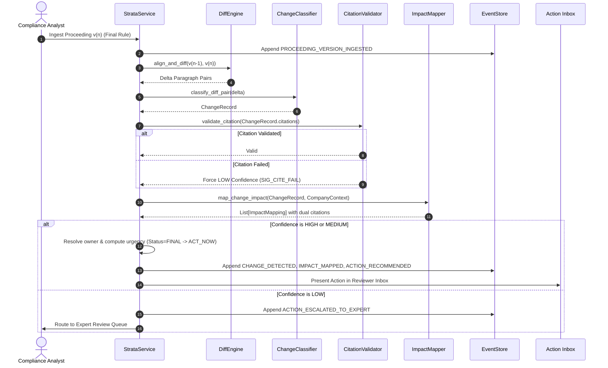

# Strata — Technical Design Document (TDD)

**A citation-grade regulatory intelligence and operations workspace for regulated enterprises**

Version: 1.3 · Status: Approved MVP Technical Design · Companion to `Strata_PRD.md`

---

## 1. System Overview & Design Principles

### 1.1 Overview & Scope
Regulated enterprises face a continuous influx of regulatory proceedings (dockets, NPRMs, revised drafts, final orders) that affect internal obligations, governing documents (policies, SOPs, contracts), and capital projects. 

Strata is a **change-to-action workspace** that ingests regulatory proceedings and enterprise context, computes deterministic diffs, extracts verifiable citations, maps impacts to company assets via dense embeddings, and routes actionable tasks to owners under a living, event-sourced audit trail.

### 1.2 Non-Negotiable Engineering Principles
1. **Citation-First, Not Summary-First**: Every claim (detected change, mapped impact, or recommended action) is anchored to an addressable character span verified deterministically against immutable snapshots before display.
2. **Deterministic Diff, Probabilistic Interpretation**: Mechanical text deltas are calculated using sequence alignment algorithms (`difflib`/LCS). LLMs are employed exclusively for bounded interpretation: classifying materiality and extracting regulatory rationale.
3. **Append-Only Living State**: No entity state or audit record is overwritten in place. Corrections, updates, and human overrides are emitted as new domain events layered chronologically over historical records.
4. **Confidence Gates Action**: A transparent multi-signal rubric governs confidence. Low-confidence or ambiguous items are structurally blocked by the state machine from creating pending operational actions and route exclusively to an Expert Review Queue.
5. **Canonical Addressability**: Ingested proceedings and internal documents are parsed into a uniform coordinate tree (`doc_id → version_id → section_id → para_id → sentence_id → char_span`). Citations are stable, resolvable pointers.

### 1.3 MVP Scoping: Local-First Baseline
For the initial MVP build, the system is strictly scoped to a **local-first, self-contained architecture**:
- **Zero Cloud Infrastructure**: Operates on a local SQLite database (`strata.db`) and local Python runtime.
- **Reproducible & Deterministic**: Runs fully offline with deterministic diffing and local/embedded vector stores, eliminating external cloud dependency risks or cold-start network latency during initial demonstration and evaluation.
- **Cloud Readiness**: Storage abstractions and service APIs are decoupled, enabling drop-in migration to cloud serverless or container platforms post-MVP.

---

## 2. High-Level Architecture

### 2.1 Architecture Diagram

```mermaid
flowchart TD
    subgraph Ingestion["1. Ingestion & Normalization"]
        Files[PDF / HTML / TXT Filings] --> Parser[Open-Source Parser: PyMuPDF / BS4]
        Parser --> Segmenter[Hierarchical Segmenter: Sec → Para → Sent]
        Segmenter --> MetaExtract[Status & Preamble Date Extractor]
    end

    subgraph Storage["2. Storage Layer (SQLite / PostgreSQL)"]
        Segmenter --> DB[(Relational Tables & Snapshots)]
        MetaExtract --> DB
        EmbedGen[Sentence-Transformers Embeddings] --> DB
        
        subgraph CoreTables["Core Database Tables"]
            users
            proceedings & proceeding_versions
            documents & obligations & projects
            change_records & impact_mappings
            actions
            audit_events (append-only)
            embeddings
        end
    end

    subgraph Pipeline["3. Analysis & Processing Pipeline"]
        DB --> Diff[Deterministic Diff Engine: difflib/LCS]
        Diff --> StatusCheck[Status Transition Detector]
        Diff --> Classify[LLM Materiality Classifier]
        Classify --> Validator[Programmatic Citation Validator]
        
        Validator --> VecSearch[Vector Embedding Search: Cosine Similarity]
        DB -.-> VecSearch
        VecSearch --> Impact[Dual-Grounded Impact Matcher]
        
        Impact --> Rubric[Confidence Rubric Evaluator]
        Rubric --> ActionGen[Action Recommender & Ownership Resolver]
        ActionGen --> DB
    end

    subgraph Workspace["4. Operations Workspace (API & UI)"]
        DB --> Inbox[Reviewer Action Inbox]
        DB --> ExpertQueue[Expert Review Queue: Low-Confidence]
        DB --> Timeline[Living Entity Timeline & Audit Dossier]
        Inbox -- Accept / Modify / Override --> DB
        ExpertQueue -- Resolve with Rationale --> DB
    end
```

### 2.2 Subsystem Responsibilities

| Subsystem | Key Components | Core Responsibility |
|---|---|---|
| **Ingestion** | `DocumentExtractor`, `DocumentSegmenter`, `MetadataExtractor` | Extracts clean text from PDF/HTML, generates addressable hierarchy with character spans, and extracts status (`DRAFT`, `PROPOSED`, `FINAL`). |
| **Storage** | `Database`, `StrataRepository`, `EventStore` | Manages relational tables in SQLite (`strata.db`) with foreign key constraints, plus an append-only event store. |
| **Analysis Pipeline** | `DiffEngine`, `CitationValidator`, `ChangeClassifier` | Aligns paragraph sequences, validates verbatim quotations against snapshots, and classifies change types/materiality. |
| **Impact & Routing** | `VectorStore`, `ImpactMapper`, `ConfidenceRubric`, `ActionRouter` | Uses dense embeddings to retrieve candidate enterprise assets, evaluates confidence signals, and deterministically resolves owners and urgency. |
| **Living State & Audit** | `EventStore`, `StrataService` | Projects chronological entity timelines and generates exportable audit dossiers showing system claims alongside human decisions. |

---

## 3. Data Pipeline & Subsystem Details

### 3.1 Ingestion & Canonical Addressing
- **Open-Source Text Extractors**:
  - `PyMuPDF` (`fitz`): Page-by-page text block extraction for regulatory orders and dockets, stripping running headers/footers.
  - `BeautifulSoup4`: DOM traversal and boilerplate removal for HTML filings (Federal Register, web dockets).
  - Regex text normalizer for plain text and Markdown.
- **Canonical Address Tree**:
  - `Section`: Heading title and structural identifier (`sec_1`).
  - `Paragraph`: Discrete narrative unit (`sec_1_p1`).
  - `Sentence`: Boundary segmentation (`sec_1_p1_s1`).
  - `char_span`: Absolute character offset tuple `[start, end]` into immutable raw text.
- **Status Classification Pass**:
  - Identifies `status` (`DRAFT`, `PROPOSED`, `FINAL`, `WITHDRAWN`) and filing/effective dates from preamble markers.

### 3.2 Change Detection & Status Transition
1. **Paragraph Sequence Alignment**:
   - Uses `difflib.SequenceMatcher` over paragraph token streams between `ProceedingVersion(n-1)` and `ProceedingVersion(n)`.
   - Produces discrete change deltas: `ADDED`, `MODIFIED`, or `REMOVED`.
2. **Materiality & Change Classification**:
   - Evaluates whether the diff represents a substantive shift: `NEW_REQUIREMENT`, `DEADLINE_SHIFT`, `SCOPE_CHANGE`, `REQUIREMENT_REMOVED`, or `DEFINITION_CHANGE`. Non-substantive formatting edits are marked `IMMATERIAL`.
3. **Programmatic Citation Validation**:
   - Code check asserts that claimed `quoted_text` is an exact (or normalized-whitespace) substring of the referenced paragraph.
   - **Fail-Safe Gate**: Failed citations are not discarded; they are demoted to `confidence = LOW` (`SIG_CITE_FAIL`) and enqueued for Expert Review.
4. **Status Transition Detection**:
   - Any shift in proceeding status (e.g., `PROPOSED → FINAL`) immediately emits a high-salience `STATUS_TRANSITION` change record.

### 3.3 Semantic Retrieval & Dual-Grounded Impact Mapping
1. **Embedding Search**:
   - Dense embeddings (`sentence-transformers/all-MiniLM-L6-v2`, 384 dimensions) represent company obligations, projects, and internal policy sections.
   - The query vector is formed from `ChangeRecord.description + "\n" + after_citation.quoted_text`.
   - Cosine similarity retrieves top-$k$ candidate assets (excluding external proceeding text).
2. **Dual-Citation Grounding**:
   - Every confirmed mapping must carry verifiable citations on both sides:
     - `change_citation`: Specific quoted span from the regulatory proceeding.
     - `affected_citation`: Verbatim quoted span from the internal obligation, project scope, or document.
3. **Many-to-Many Propagation**:
   - If an internal document (e.g., SOP or permit) is impacted, all compliance obligations linked to that document are automatically linked.

### 3.4 Action Routing & Urgency Business Logic
1. **Deterministic Ownership Resolution**:
   - The model recommends *what* action to take; the system deterministically looks up *who* owns the affected asset via `owner_id`.
2. **Deterministic Urgency Rules**:
   - `status == DRAFT` or `PROPOSED` → Urgency capped at `MONITOR`.
   - `status == FINAL` → Urgency set to `ACT_NOW` (or `ACT_SOON` if deadline $> 90$ days).
   - `STATUS_TRANSITION` to `FINAL` → Urgency set to `ACT_NOW`.
3. **Action Lifecycle States**:
   - `PENDING` → `ACCEPTED` | `MODIFIED` | `REJECTED` | `DONE`.

### 3.5 Confidence Rubric & Expert Review Gating
Confidence is evaluated against an auditable, multi-signal rules engine:

| Signal | Condition | Confidence Effect | System Action |
|---|---|---|---|
| `SIG_CITE_FAIL` | Quoted span failed programmatic substring verification | Force `LOW` | Enqueue in Expert Review Queue |
| `SIG_AMBIG_TERM` | Undefined statutory phrasing detected (e.g., *"ancillary emergency asset"*) | Force `LOW` | Enqueue in Expert Review Queue |
| `SIG_RANK_TIE` | Top candidate enterprise assets score within 3% retrieval margin | Cap at `MEDIUM` | Advisory flag in Reviewer Inbox |
| `SIG_HIGH_STAKES` | Change alters statutory deadlines, civil penalties, or applicability scope | Cap at `MEDIUM` | Heightened Review Flag |
| `SIG_CLEAN_GROUND`| Citations verified, single distinct match, unambiguous legal text | Eligible for `HIGH` | Standard Action Inbox |

- **Structural Blocking**: Low-confidence items are structurally blocked from generating actionable operational tasks until resolved by an expert reviewer with recorded rationale.

---

## 4. Data Model & Database Architecture

### 4.1 Canonical Data Schema

```
Proceeding (id, docket_id, title, jurisdiction)
 └── ProceedingVersion (id, proceeding_id, version_label, status, filed_date, effective_date, raw_text)
      └── Section (section_id, heading)
           └── Paragraph (para_id, text)
                └── Sentence (sentence_id, text, char_span: [start, end])

CompanyContext:
 ├── User (id, name, email, role: REVIEWER | ASSIGNEE | LEAD | ADMIN)
 ├── Document (id, title, doc_type: POLICY | PROCEDURE | CONTRACT | FILING, owner_id, raw_text, sections)
 ├── Obligation (id, description, owner_id, status: ACTIVE | SUPERSEDED | CLOSED, linked_doc_id)
 └── Project (id, name, description, owner_id, status, linked_obligations, milestones)

Analysis & Living State:
 ├── ChangeRecord (id, proceeding_id, from_version_id, to_version_id, change_type, materiality, description, before_citation, after_citation, confidence, confidence_signals)
 ├── ImpactMapping (id, change_id, affected_type: OBLIGATION | PROJECT | DOCUMENT, affected_id, rationale, change_citation, affected_citation, confidence)
 ├── ActionRecommendation (id, mapping_id, recommended_action, suggested_owner_id, urgency: MONITOR | ACT_SOON | ACT_NOW, state: PENDING | ACCEPTED | MODIFIED | REJECTED | DONE)
 └── AuditEvent (id, stream_id, event_type, actor_type: SYSTEM | USER, actor_id, payload, linked_citations, timestamp)
```

### 4.2 Relational Database Schema (SQLite DDL)

```sql
-- Core Relational Tables
CREATE TABLE users (
    id TEXT PRIMARY KEY,
    name TEXT NOT NULL,
    email TEXT UNIQUE NOT NULL,
    role TEXT CHECK(role IN ('REVIEWER', 'ASSIGNEE', 'LEAD', 'ADMIN')) NOT NULL,
    created_at TIMESTAMP DEFAULT CURRENT_TIMESTAMP
);

CREATE TABLE proceedings (
    id TEXT PRIMARY KEY,
    docket_id TEXT UNIQUE NOT NULL,
    title TEXT NOT NULL,
    jurisdiction TEXT NOT NULL,
    created_at TIMESTAMP DEFAULT CURRENT_TIMESTAMP
);

CREATE TABLE proceeding_versions (
    id TEXT PRIMARY KEY,
    proceeding_id TEXT NOT NULL REFERENCES proceedings(id) ON DELETE CASCADE,
    version_label TEXT NOT NULL,
    status TEXT CHECK(status IN ('DRAFT', 'PROPOSED', 'FINAL', 'WITHDRAWN')) NOT NULL,
    filed_date DATE NOT NULL,
    effective_date DATE,
    comment_due_date DATE,
    raw_text TEXT NOT NULL,
    parsed_sections_json TEXT NOT NULL,
    created_at TIMESTAMP DEFAULT CURRENT_TIMESTAMP
);

CREATE TABLE documents (
    id TEXT PRIMARY KEY,
    title TEXT NOT NULL,
    doc_type TEXT CHECK(doc_type IN ('POLICY', 'PROCEDURE', 'CONTRACT', 'FILING')) NOT NULL,
    owner_id TEXT NOT NULL REFERENCES users(id),
    current_version INTEGER DEFAULT 1,
    raw_text TEXT NOT NULL,
    parsed_sections_json TEXT NOT NULL,
    created_at TIMESTAMP DEFAULT CURRENT_TIMESTAMP
);

CREATE TABLE obligations (
    id TEXT PRIMARY KEY,
    description TEXT NOT NULL,
    owner_id TEXT NOT NULL REFERENCES users(id),
    status TEXT CHECK(status IN ('ACTIVE', 'SUPERSEDED', 'CLOSED')) DEFAULT 'ACTIVE',
    linked_doc_id TEXT REFERENCES documents(id),
    source_citation_json TEXT,
    created_at TIMESTAMP DEFAULT CURRENT_TIMESTAMP
);

CREATE TABLE projects (
    id TEXT PRIMARY KEY,
    name TEXT NOT NULL,
    description TEXT NOT NULL,
    owner_id TEXT NOT NULL REFERENCES users(id),
    status TEXT CHECK(status IN ('ACTIVE', 'COMPLETED', 'ON_HOLD')) DEFAULT 'ACTIVE',
    milestones_json TEXT,
    created_at TIMESTAMP DEFAULT CURRENT_TIMESTAMP
);

CREATE TABLE project_obligations (
    project_id TEXT NOT NULL REFERENCES projects(id) ON DELETE CASCADE,
    obligation_id TEXT NOT NULL REFERENCES obligations(id) ON DELETE CASCADE,
    PRIMARY KEY (project_id, obligation_id)
);

CREATE TABLE change_records (
    id TEXT PRIMARY KEY,
    proceeding_id TEXT NOT NULL REFERENCES proceedings(id),
    from_version_id TEXT REFERENCES proceeding_versions(id),
    to_version_id TEXT NOT NULL REFERENCES proceeding_versions(id),
    change_type TEXT NOT NULL,
    materiality TEXT CHECK(materiality IN ('MATERIAL', 'IMMATERIAL')) NOT NULL,
    description TEXT NOT NULL,
    before_citation_json TEXT,
    after_citation_json TEXT,
    confidence TEXT CHECK(confidence IN ('HIGH', 'MEDIUM', 'LOW')) NOT NULL,
    confidence_signals_json TEXT,
    confidence_rationale TEXT,
    detected_at TIMESTAMP DEFAULT CURRENT_TIMESTAMP
);

CREATE TABLE impact_mappings (
    id TEXT PRIMARY KEY,
    change_id TEXT NOT NULL REFERENCES change_records(id) ON DELETE CASCADE,
    affected_type TEXT CHECK(affected_type IN ('OBLIGATION', 'PROJECT', 'DOCUMENT')) NOT NULL,
    affected_id TEXT NOT NULL,
    rationale TEXT NOT NULL,
    change_citation_json TEXT NOT NULL,
    affected_citation_json TEXT NOT NULL,
    confidence TEXT CHECK(confidence IN ('HIGH', 'MEDIUM', 'LOW')) NOT NULL,
    confidence_signals_json TEXT,
    created_at TIMESTAMP DEFAULT CURRENT_TIMESTAMP
);

CREATE TABLE actions (
    id TEXT PRIMARY KEY,
    mapping_id TEXT NOT NULL REFERENCES impact_mappings(id) ON DELETE CASCADE,
    recommended_action TEXT NOT NULL,
    suggested_owner_id TEXT NOT NULL REFERENCES users(id),
    urgency TEXT CHECK(urgency IN ('MONITOR', 'ACT_SOON', 'ACT_NOW')) NOT NULL,
    state TEXT CHECK(state IN ('PENDING', 'ACCEPTED', 'MODIFIED', 'REJECTED', 'DONE')) DEFAULT 'PENDING',
    created_at TIMESTAMP DEFAULT CURRENT_TIMESTAMP,
    updated_at TIMESTAMP DEFAULT CURRENT_TIMESTAMP
);

-- Append-Only Event Store Table
CREATE TABLE audit_events (
    id TEXT PRIMARY KEY,
    stream_id TEXT NOT NULL,
    event_type TEXT NOT NULL,
    actor_type TEXT CHECK(actor_type IN ('SYSTEM', 'USER')) NOT NULL,
    actor_id TEXT NOT NULL,
    payload_json TEXT NOT NULL,
    linked_citations_json TEXT,
    timestamp TIMESTAMP DEFAULT CURRENT_TIMESTAMP
);

-- Vector Embeddings Table
CREATE TABLE embeddings (
    id TEXT PRIMARY KEY,
    entity_type TEXT CHECK(entity_type IN ('PROCEEDING_PARA', 'DOC_PARA', 'OBLIGATION', 'PROJECT')) NOT NULL,
    entity_id TEXT NOT NULL,
    chunk_id TEXT NOT NULL,
    chunk_text TEXT NOT NULL,
    embedding_blob BLOB NOT NULL
);
```

### 4.3 Append-Only Event Sourcing
- Every analytical determination, state transition, and human override emits an immutable `AuditEvent`:
  - `PROCEEDING_VERSION_INGESTED`
  - `DOCUMENT_INGESTED`
  - `CHANGE_DETECTED`
  - `STATUS_TRANSITION_DETECTED`
  - `IMPACT_MAPPED`
  - `ACTION_RECOMMENDED`
  - `ACTION_ESCALATED_TO_EXPERT`
  - `EXPERT_REVIEW_RESOLVED`
  - `ACTION_STATE_CHANGED`
  - `HUMAN_OVERRIDE_RECORDED`
- Read models (Reviewer Inbox, Expert Review Queue, Entity Living Timelines) are projections folded from this append-only stream.

---

## 5. Core Interfaces & Execution Flow

### 5.1 End-to-End Pipeline Sequence



### 5.2 Strata Service API Contract (`StrataService`)

```python
class StrataService:
    def ingest_user(user_id: str, name: str, email: str, role: UserRole) -> User
    def ingest_proceeding_version(proceeding_id: str, version_label: str, file_path_or_content: str, ...) -> ProceedingVersion
    def ingest_document(doc_id: str, title: str, doc_type: str, owner_id: str, raw_text: str) -> InternalDocument
    def ingest_obligation(obl_id: str, description: str, owner_id: str, linked_doc_id: str) -> Obligation
    def ingest_project(proj_id: str, name: str, description: str, owner_id: str, linked_obligations: list[str]) -> Project
    
    def analyze_versions(proceeding_id: str, prev_version_id: str, curr_version_id: str) -> dict
    def resolve_expert_review(target_id: str, reviewer_id: str, decision: str, rationale: str) -> AuditEvent
    def record_human_override(action_id: str, user_id: str, updated_action_text: str, override_rationale: str) -> ActionRecommendation
```

---

## 6. Living State & Audit Defensibility

### 6.1 Living Timeline & Audit Reconstruction
To satisfy PRD **G6** and **FR7.3**, an auditor must be able to reconstruct the historical decision-making process without access to raw model prompts or ephemeral server logs.
- The `generate_audit_dossier(stream_id)` method queries all events linked to `stream_id` (e.g., `obligation:OBL-NOX-01` or `proceeding:FERC-RM22-14`) ordered by timestamp.
- Produces a chronological record showing what changed, when the enterprise became aware, what was concluded, what actions were recommended, and who signed off.

### 6.2 Defensible Human Overrides
When a compliance officer modifies or rejects an action:
1. The original system recommendation is **never deleted or updated in place**.
2. A new `HUMAN_OVERRIDE_RECORDED` event is appended containing:
   - `original_action`: The exact text generated by the system.
   - `modified_action`: The user's revised instruction.
   - `override_rationale`: Mandatory explanation for why the system interpretation was adjusted.
   - `actor_id`: ID of the human reviewer making the modification.
3. The action state transitions to `MODIFIED` while preserving complete audit reconstructability.

---

## 7. Technology Stack

### 7.1 MVP Implementation Stack

| Layer | Component | Role in MVP |
|---|---|---|
| **Database** | SQLite (`strata.db`) | Relational entity storage and append-only event store with full foreign key constraints. Zero infrastructure setup. |
| **Document Parser** | `PyMuPDF` (`fitz`) & `BeautifulSoup4` | Open-source PDF text extraction (stripping running headers) and HTML DOM normalization. |
| **Embeddings** | `sentence-transformers/all-MiniLM-L6-v2` | Dense 384-dimensional vector embeddings for semantic asset retrieval via cosine similarity. |
| **Diffing Engine** | Python `difflib.SequenceMatcher` | Deterministic structural paragraph alignment without model hallucination risk. |
| **LLM Classification** | Claude 3.5 Sonnet / Gemini Flash | Schema-constrained materiality and change classification. |
| **Backend API** | FastAPI (Python 3.9+) | Lightweight REST service serving analysis, inboxes, expert queues, and audit exports. |
| **Test Frameworks** | `behave` & `pytest` | Standard Cucumber/Gherkin BDD specifications and unit/integration quality gates. |

### 7.2 Production Evolution Path
- **Database**: PostgreSQL 16 with `pgvector` for combined SQL queries and high-throughput vector index scans.
- **Document Store**: S3-compatible WORM (Write Once, Read Many) object storage for raw regulatory filings.
- **Streaming & Event Store**: EventStoreDB or Kafka for multi-jurisdiction distributed docket streams.
- **Identity & RBAC**: SAML / OIDC enterprise SSO for role-based action routing and audit attribution.

### 7.3 Deployment Alternatives & Platform Evaluation

While the **local-first baseline is retained for the MVP**, the architecture maps cleanly to modern serverless and edge platforms:

1. **Cloudflare Edge Stack (Recommended Serverless Target)**:
   - **Database**: **Cloudflare D1** provides native serverless SQLite at the edge. The MVP schema runs on D1 without modifications.
   - **Vector Search & Embeddings**: **Cloudflare Vectorize** paired with **Workers AI** (`bge-small-en-v1.5`) executes embedding generation and similarity search natively at the edge without heavy Python/PyTorch dependencies.
   - **Document Storage**: **Cloudflare R2** (S3-compatible, zero egress fees) for immutable PDF/HTML snapshots.
   - **Workspace UI**: **Cloudflare Pages** for global edge hosting of the React/Vite frontend.

2. **Vercel Serverless Stack**:
   - **Frontend**: Native Next.js / React hosting on Vercel's edge network.
   - **Backend API**: Python Serverless Functions (`api/index.py` wrapping FastAPI).
   - **Storage Constraint**: Because Vercel functions have an ephemeral local disk (wiped between cold starts), a local `strata.db` file cannot persist state. To deploy on Vercel, the database must be backed by a serverless cloud database such as **Turso** (libSQL / SQLite over HTTP) or **Neon** (serverless Postgres).

3. **Containerized Cloud Stack (Zero Code Changes)**:
   - Platforms like **Fly.io**, **Railway**, or **Google Cloud Run** allow deploying the existing Python FastAPI container alongside a mounted persistent volume for `strata.db`, requiring zero architectural adaptations from the local MVP.

---

## 8. Verification & Testing Framework

### 8.1 Cucumber BDD Feature Specifications (`features/`)
Testing is driven by standard Gherkin feature files executed with `behave`:

1. **`change_detection.feature`**: Verifies paragraph diffing, status transition detection (`PROPOSED → FINAL`), and machine-verifiable citations across FERC Order 2023 versions.
2. **`impact_mapping.feature`**: Verifies embedding retrieval and dual-grounded citations mapping FERC inverter ride-through rules to the Desert Solar Project (`PROJ-SOLAR-DESERT-02`).
3. **`confidence_escalation.feature`**: Verifies that ambiguous statutory language in EPA NSPS Subpart KKKK (*"ancillary emergency generation asset"*) is demoted to `LOW` confidence, routed to the Expert Review Queue, and logged upon resolution.
4. **`living_audit_trail.feature`**: Verifies that human overrides append new audit events preserving the original text, and reconstructs the full living dossier for `OBL-CEMS-02`.

### 8.2 Automated Quality Gates (`tests/`)
Pytest unit and integration test suite enforcing five quality gates:

```bash
PYTHONPATH=. pytest -v tests/
PYTHONPATH=. behave features/
```

| Gate | Test Module | Verification Assertion |
|---|---|---|
| **1. Citation Veracity** | `tests/test_citation_validator.py` | Exact/normalized substring validation passes; hallucinated quotes fail deterministically. |
| **2. Diff Determinism** | `tests/test_diff_engine.py` | Sequence alignment accurately detects paragraph additions, deletions, and modifications. |
| **3. Confidence Gating** | `tests/test_confidence_rubric.py` | `SIG_CITE_FAIL` and `SIG_AMBIG_TERM` force `LOW` confidence and trigger escalation. |
| **4. Event Immutability** | `tests/test_database_and_events.py` | Appending events preserves chronological integrity and enables dossier reconstruction. |
| **5. End-to-End Integration**| `tests/test_end_to_end.py` | Runs the full pipeline on real FERC and EPA regulations against the two enterprise test projects. |

---

## 9. Requirements Traceability Matrix

| PRD Req / Goal | Requirement Description | Architectural Subsystem / Component | Implementation Mechanism |
|---|---|---|---|
| **G1 / FR2.1, FR2.2** | Detect material changes between proceeding versions | Deterministic Diff Pipeline (§3.2) | Paragraph sequence alignment (`difflib`) and schema-constrained LLM materiality classification. |
| **G2 / FR3.1, FR3.2** | Citation-grade grounding & verifiable claims | Canonical Coordinate System & Citation Validator (§3.1, §3.2) | Hierarchical coordinates (`doc/ver/sec/para/char_span`). Substring match code check gates all claims. |
| **G3 / FR2.4, FR5.3** | Classify document status (draft vs final) & gate urgency | Status Extractor & Urgency Rules Engine (§3.1, §3.4) | Preamble regex pass. Transition detector emits `STATUS_TRANSITION`. Urgency rules override model. |
| **G4 / FR4.1, FR4.2** | Map changes to internal obligations, projects, docs | Dense Vector Search & Impact Mapping Engine (§3.3) | Dense embedding retrieval (`sentence-transformers`) feeding dual-grounding LLM reasoner with bidirectional citations. |
| **G5 / FR5.1, FR5.2** | Recommend actionable tasks & route to owners | Action Recommendation & Routing Engine (§3.4) | Model drafts action; owner is resolved deterministically from entity metadata (`owner_id`). |
| **G6 / FR7.1, FR7.3** | Append-only living state & auditable timeline | Event Sourcing & Projection Engine (§4.3, §6.1) | Immutable `audit_events` table. Deterministic `generate_audit_dossier` reconstructs complete history. |
| **G7 / FR6.1, FR6.3** | Transparent confidence rubric & Expert Escalation | Confidence Scoring Engine & Expert Queue (§3.5) | Explicit multi-signal rubric. `LOW` confidence structurally blocks action routing, dispatching to queue. |
| **G8 / FR4.3** | Detect conflicts & dependencies across regulations | Many-to-Many Impact Propagation (§3.3) | Document impacts automatically cascade to linked obligations and projects on shared timelines. |
| **FR7.4** | Defensible Human Overrides | Human Override Handler (§6.2) | Overrides append new `HUMAN_OVERRIDE_RECORDED` events preserving both model hypothesis and user correction. |
