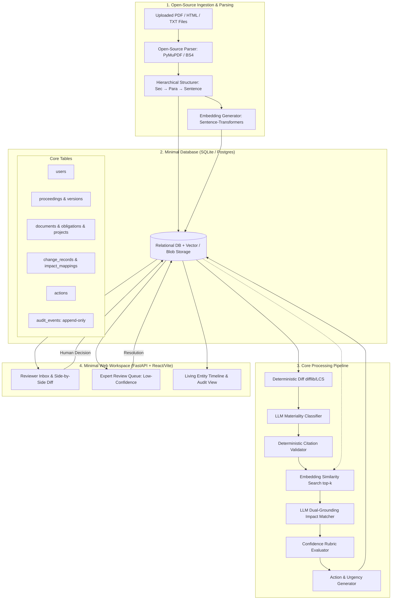
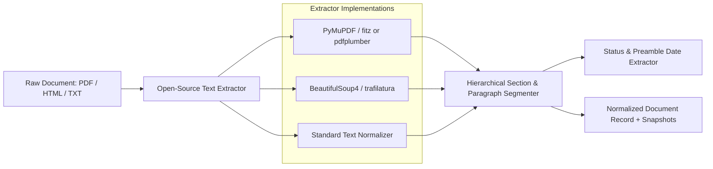
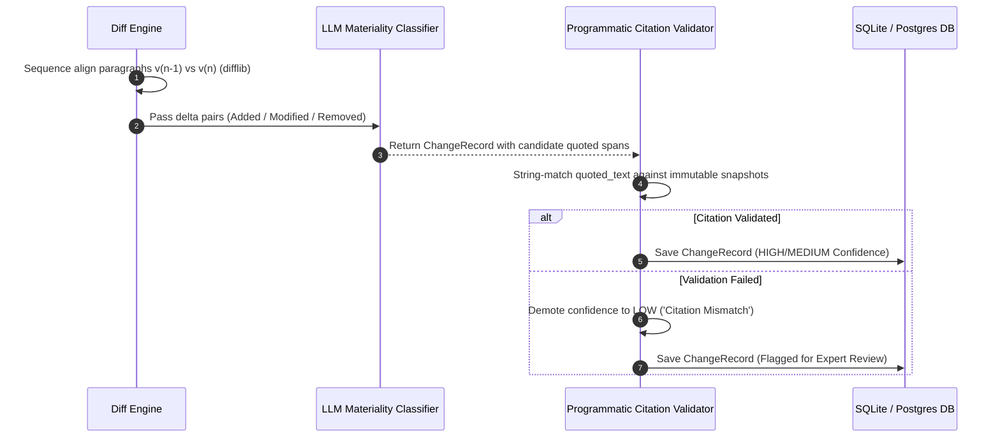
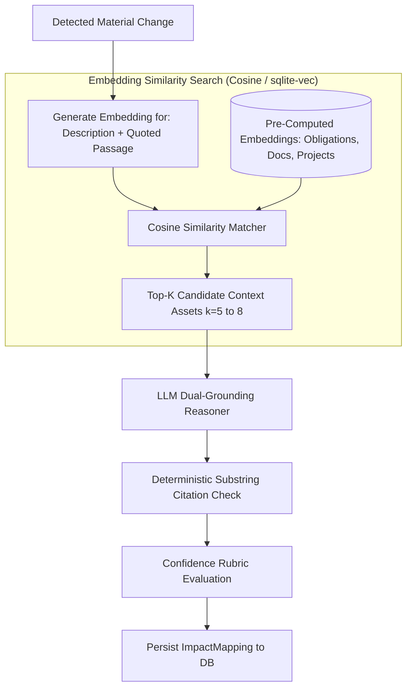
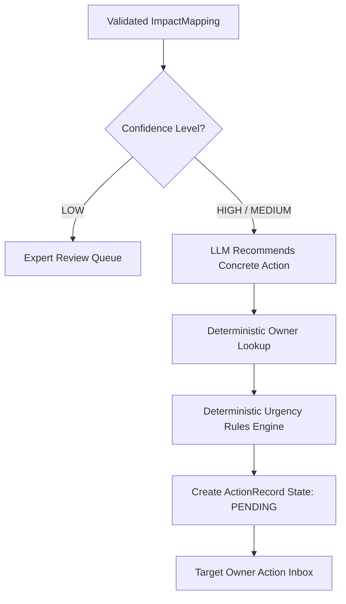
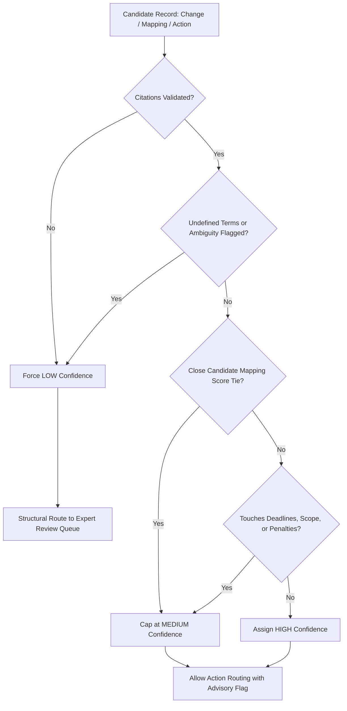
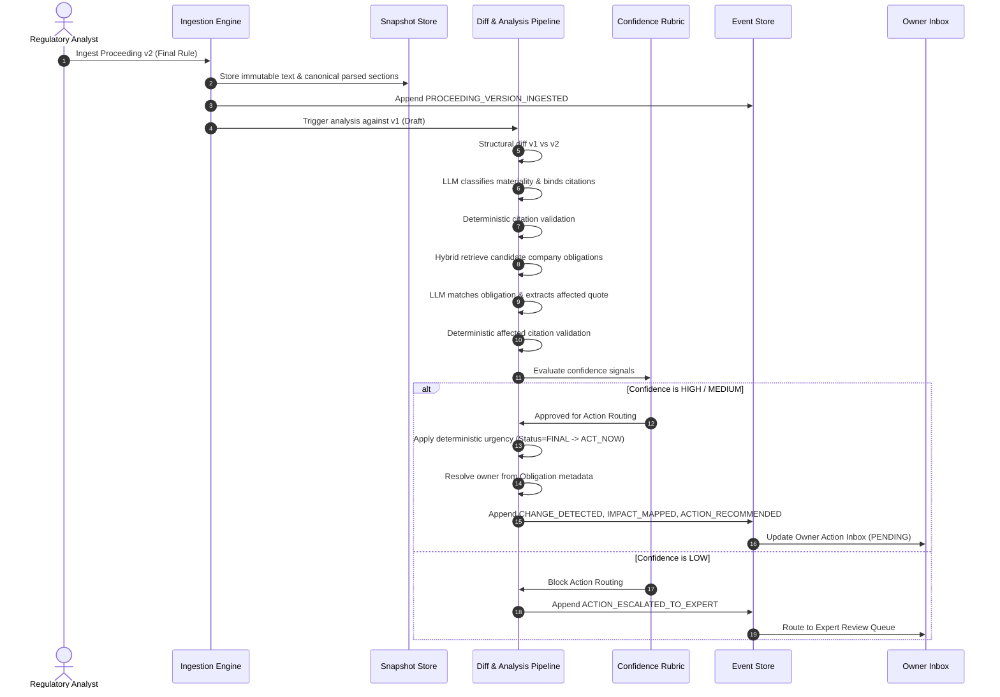
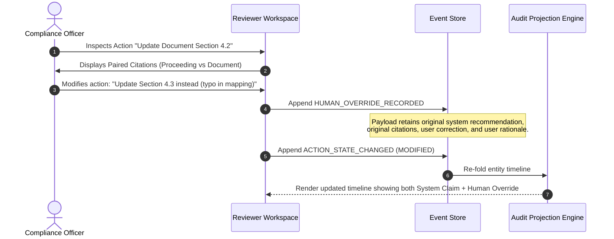
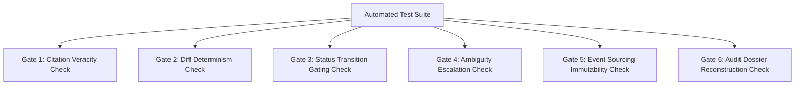

# Strata — System Architecture & Technical Design Document (TDD)

**A citation-grade regulatory intelligence and operations workspace for regulated enterprises**

Version: 1.2 · Status: Unified MVP Architecture & Technical Design · Companion to `Strata_PRD.md`

---

## 1. Executive Summary, MVP Scope & Design Principles

### 1.1 Executive Summary & Problem Context

Regulated enterprises (utilities, energy operators, financial institutions, healthcare providers) operate within a continuous flow of regulatory proceedings: Notices of Proposed Rulemaking (NPRMs), staff whitepapers, draft revisions, and binding final orders. Each proceeding evolves across multiple versions, subtly altering compliance requirements, technical thresholds, and reporting timelines in ways that ripple directly into governing documents (policies, SOPs, contracts), internal obligations, and capital projects.

Standard industry solutions fail this workflow: alert feeds and search engines detect *that* a filing occurred, but place the burden of full-text re-review, delta analysis, and impact assessment on human teams. The critical bottleneck is **interpretation, attribution, and actionability**:
- Discerning exactly what changed between iterations down to the sentence and paragraph.
- Differentiating between non-binding proposals (`DRAFT`/`PROPOSED`) and legally enforceable mandates (`FINAL`).
- Mapping regulatory language to internal obligations, projects, and policies without loose semantic drift.
- Producing auditable, citation-grade evidence that withstands regulatory scrutiny years later.

Strata resolves this gap by providing an end-to-end, change-to-action workspace powered by deterministic text alignment, constrained LLM reasoning, verifiable dual-grounded citations, and an append-only event-sourced audit log.

---

### 1.2 Core Design Principles

These five core principles guide every architectural, data modeling, and pipeline design decision across Strata:

1. **Citation-first, not summary-first.**
   The system never generates a claim or summary and then scrambles to locate an after-the-fact citation. It retrieves and isolates verified textual spans first, bounds LLM reasoning strictly to those spans, and deterministically validates that all quoted passages exist verbatim in immutable source snapshots.
2. **Deterministic diff, probabilistic interpretation.**
   "What text changed" is computed strictly via deterministic algorithms (structural sequence alignment and paragraph hashing). LLMs are employed exclusively for interpretation: classifying materiality, extracting regulatory implications, and synthesizing plain-language impacts anchored to the deterministic diff.
3. **Append-only state.**
   Nothing in the regulatory, obligation, or project timeline is ever overwritten, updated in-place, or destructively edited. Corrections, re-interpretations, and human overrides are emitted as immutable new events layered chronologically on prior records.
4. **Confidence gates action, not just display.**
   A low-confidence interpretation cannot progress to a routed operational action. This constraint is structurally enforced by the workflow state machine rather than treated as an advisory UI badge. Ambiguous items route exclusively to an Expert Review Queue.
5. **Everything addressable.**
   Every ingested document—both external regulatory proceedings and internal corporate policies—is chunked into an immutable, addressable coordinate hierarchy (`doc_id → version_id → section_id → para_id → sentence_id → char_span`). Citations are permanently resolvable pointers, never free-text paraphrases.

---

### 1.3 MVP Scope & Non-Negotiable Requirements

For the **MVP**, the system is intentionally architected to be **minimal, self-contained, and pragmatic**, stripping away unnecessary distributed infrastructure complexity (e.g., no distributed brokers like Kafka, no multi-tenant microservices) while retaining the non-negotiable core capabilities specified in `Strata_PRD.md`:

1. **Citation-grade veracity**: Claims must point to verifiable paragraph/sentence spans checked by deterministic code.
2. **Deterministic diffing**: Text changes are detected with standard algorithms; LLMs are used only for materiality and impact reasoning.
3. **Draft vs. Final status gating**: Proceeding status gates action urgency (`DRAFT` = `MONITOR`, `FINAL` = `ACT_NOW` / `ACT_SOON`).
4. **Relational + Audit Database**: A single unified database (SQLite / PostgreSQL) storing users, documents, projects, obligations, actions, and an append-only audit event log.
5. **Open-Source Document Ingestion**: Ingesting PDF, HTML, and text via standard open-source libraries (`PyMuPDF`, `BeautifulSoup4`) with hierarchical section/paragraph chunking.
6. **Embeddings for Regulatory Retrieval**: Dense semantic embeddings to identify candidate regulations and map impacts to internal company assets.
7. **Human-in-the-Loop Escalation**: Ambiguous or low-confidence interpretations route to an Expert Review queue.

---

## 2. High-Level System Architecture

### 2.1 Functional Block Diagram

```
┌─────────────────┐     ┌──────────────────────┐     ┌───────────────────────┐
│  Ingestion       │     │ Change Detection      │     │ Impact Mapping &        │
│  Layer           │────▶│ & Classification       │────▶│ Action Recommendation  │
│  (proceedings +  │     │ Pipeline               │     │ Engine                 │
│  company context)│     │ (diff → LLM classify → │     │ (retrieval + LLM       │
│                  │     │  citation validate)    │     │  match + citation      │
└─────────────────┘     └──────────────────────┘     │  validate + routing)   │
        │                          │                    └───────────┬────────────┘
        ▼                          ▼                                ▼
┌─────────────────────────────────────────────────────────────────────────┐
│                    Living Project State Store (append-only)             │
│  Obligations · Projects · Documents · Change Records · Actions ·        │
│  Confidence flags · Review decisions · Full audit event log             │
└─────────────────────────────────────────────────────────────────────────┘
        │                                                    │
        ▼                                                    ▼
┌─────────────────┐                                ┌───────────────────────┐
│ Expert Review    │◀───────low-confidence──────────│ Reviewer Workspace UI  │
│ Queue            │        escalation              │ (timelines, citations, │
│                  │────────resolution feeds back───▶│  action inbox)         │
└─────────────────┘                                └───────────────────────┘
```

---

### 2.2 System Component Topology



---

## 3. Subsystem Detailed Design & Processing Pipeline

### 3.1 Stage 1 — Open-Source Ingestion & Document Parser Subsystem

To minimize operational complexity, the system replaces proprietary or commercial ingestion pipelines with battle-tested open-source libraries that extract clean, structured text from PDFs, HTML filings, and plain text.



#### Open-Source Extractors
1. **PDF Documents (Docket filings, regulatory orders, agency releases)**:
   - Utilizes `PyMuPDF` (`fitz`) or `pdfplumber` to extract page-by-page text blocks while preserving layout coordinates, section headers, and paragraph breaks.
   - Strips running headers, footers, and page numbers to prevent spurious diff artifacts.
2. **HTML Documents (Federal Register entries, state web dockets, e-filings)**:
   - Utilizes `BeautifulSoup4` and `trafilatura` to clean DOM trees, extract body text, and convert `<h1>`-`<h6>` tags into structural section headings.
3. **Plain Text / Markdown (Internal policies, SOPs, draft notes)**:
   - Standard regex-based structural parser recognizing legal/regulatory numbering schemes (`Article I`, `Section 4.1`, `Part 201`, `§ 12.3`).

#### Hierarchical Structural Chunking
Every parsed document is decomposed into a referenceable JSON hierarchy:
- **`Section`**: Heading title, section number, and identifier.
- **`Paragraph`**: Discrete narrative block, indexed within the parent section.
- **`Sentence`**: Segmented via rule-based sentence boundary detection.
- **`char_span`**: Tuple `[start, end]` relative to the immutable raw text snapshot, ensuring exact character-level citation verification.

#### Preamble Status & Metadata Extraction
A constrained heuristic pass extracts:
- `status`: `DRAFT` (NPRMs, draft staff papers), `PROPOSED` (proposed rules), `FINAL` (final orders, adopted rules), `WITHDRAWN`.
- `filed_date`, `effective_date`, `comment_due_date`.
- Extracted dates and status are cross-checked against explicit textual markers ("this Final Rule is effective...", "comments due by...") in the preamble before persisting.

---

### 3.2 Stage 2 — Deterministic Diff & Change Detection Pipeline

Change detection cleanly separates mechanical delta computation from semantic interpretation (PRD **G1**, **G2**).



#### Step 1: Deterministic Paragraph Sequence Alignment
- Structural sequence alignment (Longest Common Subsequence over tokenized paragraph hashes) aligns `ProceedingVersion(n-1)` with `ProceedingVersion(n)`.
- Eliminates noise caused by line wrapping, formatting changes, or re-pagination.
- Produces discrete delta tuples: `(DIFF_TYPE: ADDED | MODIFIED | REMOVED, prev_para_ref, curr_para_ref)`.

#### Step 2: Constrained LLM Materiality Classification
- The LLM is fed **only** the modified delta pairs with immediate heading context. It never processes entire documents at large to discover differences.
- Prompt enforces strict JSON Schema output conforming to `ChangeRecord`:
  - `change_type`: `NEW_REQUIREMENT`, `DEADLINE_SHIFT`, `SCOPE_CHANGE`, `REQUIREMENT_REMOVED`, `DEFINITION_CHANGE`, `STATUS_TRANSITION`, `OTHER`.
  - `materiality`: `MATERIAL` (triggers impact mapping) vs `IMMATERIAL` (logged, excluded from downstream action routing).
  - `description`: Plain-language synthesis of the substantive delta.
  - `before_citation` / `after_citation`: Quoted strings referencing specific paragraph coordinates.

#### Step 3: Programmatic Citation Validator (Non-LLM Gate)
- Independent Python verification module.
- Directly retrieves text at `(version_id, section_id, para_id)` from the immutable snapshot.
- Asserts that `quoted_text` is an exact (or whitespace-normalized) substring of the referenced text.
- **Fail-Safe Behavior**: If the quoted text does not verify, the record is **not** discarded. It is marked `confidence = LOW` with diagnostic rationale (`"Citation span verification failed against source snapshot"`) and routed to the Expert Review Queue.

#### Step 4: Status Transition Detection
- An independent state-machine evaluator checks `prev_version.status` vs `curr_version.status`.
- A transition (e.g., `PROPOSED → FINAL`) creates an independent `STATUS_TRANSITION` `ChangeRecord`.
- Emitted with maximum salience because it alters the legal bindingness of all existing obligations under that proceeding.

---

### 3.3 Stage 3 — Embedding-Based Regulatory Identification & Impact Mapping

Dense semantic embeddings solve two critical matching challenges:
1. **Identifying Relevant Regulations**: Quickly surfacing which proceedings or dockets apply to specific business functions, projects, or compliance areas.
2. **Impact Mapping**: Narrowing the entire enterprise corpus (hundreds of policy sections and obligations) down to the top-$k$ candidates for a detected change.



#### Step 1: Embedding Model & Generation
- **Model Choice**: Lightweight, open-source local model (`sentence-transformers/all-MiniLM-L6-v2`, 384 dimensions) or hosted embedding API (`text-embedding-3-small`, 1536 dimensions).
- **Embedded Units**:
  - Internal Policies & Procedures: Embedded at the **Paragraph** level with Section title context prefixed.
  - Internal Obligations: Embedded using obligation title + substantive description.
  - Projects: Embedded using project name + scope description + milestone titles.
- **Storage**: Stored directly in the `embeddings` table within SQLite (via BLOB or `sqlite-vec`) or computed in-memory via NumPy for the MVP dataset.

#### Step 2: Vector Search & Candidate Retrieval
- For each `MATERIAL` change, an embedding vector is generated from `ChangeRecord.description + "\n" + after_citation.quoted_text`.
- Cosine similarity ranking retrieves the top-$k$ ($k=5$ to $8$) most semantically proximate company assets.
- Threshold filtering rejects low-similarity noise before invoking the LLM.

#### Step 3: LLM Dual-Grounding Matching Contract
The LLM evaluates each candidate against the change record under a strict verification contract:
1. It must determine whether an actual operational, legal, or procedural dependency exists.
2. It must extract an exact verbatim quote from the **internal enterprise asset** (`affected_side_citation`).
3. It must articulate a direct rationale explaining why the regulatory quote impacts the internal quote.
4. If it cannot quote an exact grounding span in the company asset, the candidate is discarded. "Thematic relevance" without textual grounding is rejected.

#### Step 4: Programmatic Affected-Side Validation
- The internal asset quotation is validated against the document snapshot using the deterministic substring checker before the mapping is finalized.

---

### 3.4 Stage 4 — Action Recommendation, Urgency Logic & Routing

Translating intelligence into an auditable task (PRD **G5**, **FR5**).



#### Step 1: Deterministic Ownership Resolution
- The LLM recommends *what* action needs to be taken (e.g., *"Amend Section 4.2 of Data Retention Policy to reflect 7-year storage for customer logs"*).
- The LLM does **not** determine *who* owns the action.
- The system deterministically resolves `suggested_owner` by looking up the assigned owner in the target `Obligation`, `Project`, or `Document` metadata. This prevents hallucinated or misdirected routing.

#### Step 2: Deterministic Urgency Matrix
To prevent LLM urgency drift, hard business rules gate urgency based on proceeding status and explicit timelines:

| Proceeding Status | Explicit Deadline Found? | Computed Urgency | Rationale / Behavior |
|---|---|---|---|
| `DRAFT` / `PROPOSED` | Any | `MONITOR` | Non-binding. Urgency capped. Informs planning without triggering premature operational changes. |
| `FINAL` | $> 90$ days | `ACT_SOON` | Binding order. Operational lead time available. |
| `FINAL` | $\le 90$ days or No Date Stated | `ACT_NOW` | Immediate compliance exposure. Prioritized in review inbox. |
| Any (`STATUS_TRANSITION`) | N/A | `ACT_NOW` | Docket transition to FINAL triggers immediate operational mobilization. |

#### Step 3: Action Lifecycle State Machine
Every recommended action is governed by an append-only state machine:
- `PENDING`: Awaiting owner/reviewer evaluation.
- `ACCEPTED`: Reviewer confirmed recommended action without edits.
- `MODIFIED`: Reviewer modified scope, action description, or reassigned owner (original recommendation preserved in event history).
- `REJECTED`: Reviewer dismissed recommendation with mandatory recorded rationale.
- `DONE`: Action implemented and verified.

---

### 3.5 Stage 5 — Transparent Confidence Scoring & Escalation Architecture

Trust is the product: a confidently wrong compliance interpretation is far worse than an honest *"needs human review"* (PRD **G7**).



#### Deterministic Confidence Rubric
Confidence is evaluated transparently via an auditable rules engine rather than an opaque floating-point score:

| Rubric Signal | Trigger Condition | System Action | Target State |
|---|---|---|---|
| `SIG_CITE_FAIL` | `quoted_text` failed substring verification on either regulatory or company side | Demote to `LOW` | Expert Review Queue |
| `SIG_AMBIG_TERM` | LLM identifies undefined key statutory terms (e.g., *"covered utility"*, *"material disruption"*) | Demote to `LOW` | Expert Review Queue |
| `SIG_RANK_TIE` | Top two candidate enterprise assets score within 5% retrieval margin | Cap at `MEDIUM` | Flagged in Reviewer Inbox |
| `SIG_HIGH_STAKES` | Language introduces or alters civil penalties, criminal liability, or immediate filing deadlines | Cap at `MEDIUM` | Heightened Review Flag |
| `SIG_CLEAN_GROUND` | Citations verified, single distinct match, unambiguous phrasing, clear obligations | Eligible for `HIGH` | Standard Action Inbox |

#### Expert Review Queue Mechanics
- Records evaluated at `LOW` are **structurally prevented** from creating pending operational actions.
- Enqueued into the **Expert Review Queue** with a complete evidence bundle: paired citations, model hypothesis, retrieval scores, and the exact rubric signal that triggered escalation.
- Resolving an item requires human review:
  - `CONFIRM`: Human validates the interpretation.
  - `CORRECT`: Human supplies corrected citations or mapping.
  - `DISMISS`: Human marks change as inapplicable.
- All resolutions append an `AuditEvent` preserving both the original system hypothesis and the human determination.

---

## 4. Algorithmic Implementations & Key Pseudocode Interfaces

The core orchestrator interfaces enforce the strict separation between deterministic code gates and probabilistic LLM generation:

```python
def detect_changes(prev_version: ProceedingVersion, curr_version: ProceedingVersion) -> list[ChangeRecord]:
    """
    Computes structural diff between versions, invokes schema-constrained
    LLM classification, and applies deterministic citation verification.
    """
    diff_pairs = structural_diff(prev_version.sections, curr_version.sections)
    records = []
    
    for pair in diff_pairs:
        # Schema-constrained LLM call bounded strictly to the modified pair
        candidate = llm_classify_change(pair)
        
        # Programmatic coordinate binding (not re-typed by model)
        candidate = bind_citations(candidate, pair)
        
        # Non-LLM gate: verify quoted string exists verbatim in snapshot
        candidate = validate_citations(candidate)
        records.append(candidate)
        
    # State-machine check: emit STATUS_TRANSITION if bindingness changed
    if prev_version.status != curr_version.status:
        records.append(make_status_transition_record(prev_version, curr_version))
        
    return records


def map_impact(change: ChangeRecord, context: CompanyContext) -> list[ImpactMapping]:
    """
    Retrieves candidate internal assets via vector search, enforces dual-grounded
    quotations, and evaluates the confidence rubric.
    """
    # Hybrid search over obligations, projects, and documents
    candidates = hybrid_retrieve(change, context, top_k=8)
    mappings = []
    
    for cand in candidates:
        # LLM must produce rationale AND verbatim quote from candidate asset
        result = llm_match(change, cand)
        if result.accepted:
            # Deterministic validation of internal asset citation
            m = bind_and_validate_mapping(change, cand, result)
            m.confidence, m.confidence_signals = score_confidence_rubric(m)
            mappings.append(m)
            
    return mappings


def recommend_action(mapping: ImpactMapping, proceeding_status: ProceedingStatus) -> ActionRecommendation | None:
    """
    Generates recommended action for High/Medium confidence mappings.
    Routes Low confidence items directly to Expert Review.
    """
    if mapping.confidence == "LOW":
        enqueue_expert_review(mapping)
        return None
        
    # LLM recommends WHAT action to take
    action = llm_recommend_action(mapping)
    
    # System deterministically resolves WHO owns it from asset metadata
    action.suggested_owner = lookup_owner(mapping.affected_id)
    
    # Business rules enforce urgency based on proceeding status & deadlines
    action.urgency = apply_urgency_rules(action, proceeding_status)
    
    # Persist in state PENDING and dispatch to owner inbox
    persist_action(action, state="PENDING")
    return action
```

---

## 5. Canonical Data Model & Storage Specifications

### 5.1 Relational Database DDL (SQLite / PostgreSQL Compatible)

A single relational database stores all normalized entities with foreign key integrity and a dedicated append-only audit table:

```sql
-- 1. Users & Roles
CREATE TABLE users (
    id TEXT PRIMARY KEY,
    name TEXT NOT NULL,
    email TEXT UNIQUE NOT NULL,
    role TEXT CHECK(role IN ('REVIEWER', 'ASSIGNEE', 'LEAD', 'ADMIN')) NOT NULL,
    created_at TIMESTAMP DEFAULT CURRENT_TIMESTAMP
);

-- 2. Regulatory Proceedings & Immutable Versions
CREATE TABLE proceedings (
    id TEXT PRIMARY KEY,
    docket_id TEXT UNIQUE NOT NULL,
    title TEXT NOT NULL,
    jurisdiction TEXT NOT NULL,
    created_at TIMESTAMP DEFAULT CURRENT_TIMESTAMP
);

CREATE TABLE proceeding_versions (
    id TEXT PRIMARY KEY,
    proceeding_id TEXT NOT NULL REFERENCES proceedings(id) ON DELETE CASCADE,
    version_label TEXT NOT NULL, -- e.g. "NPRM", "Revised Draft", "Final Order"
    status TEXT CHECK(status IN ('DRAFT', 'PROPOSED', 'FINAL', 'WITHDRAWN')) NOT NULL,
    filed_date DATE NOT NULL,
    effective_date DATE,
    comment_due_date DATE,
    raw_text TEXT NOT NULL,
    parsed_sections_json JSON NOT NULL, -- Section -> Paragraph -> Sentence hierarchy
    created_at TIMESTAMP DEFAULT CURRENT_TIMESTAMP
);

-- 3. Governing Internal Documents (Policies, SOPs, Contracts)
CREATE TABLE documents (
    id TEXT PRIMARY KEY,
    title TEXT NOT NULL,
    doc_type TEXT CHECK(doc_type IN ('POLICY', 'PROCEDURE', 'CONTRACT', 'FILING')) NOT NULL,
    owner_id TEXT NOT NULL REFERENCES users(id),
    current_version INTEGER DEFAULT 1,
    raw_text TEXT NOT NULL,
    parsed_sections_json JSON NOT NULL,
    created_at TIMESTAMP DEFAULT CURRENT_TIMESTAMP
);

-- 4. Company Obligations
CREATE TABLE obligations (
    id TEXT PRIMARY KEY,
    description TEXT NOT NULL,
    owner_id TEXT NOT NULL REFERENCES users(id),
    status TEXT CHECK(status IN ('ACTIVE', 'SUPERSEDED', 'CLOSED')) DEFAULT 'ACTIVE',
    linked_doc_id TEXT REFERENCES documents(id),
    source_citation_json JSON, -- Optional initial regulatory basis
    created_at TIMESTAMP DEFAULT CURRENT_TIMESTAMP
);

-- 5. Company Projects & Workstreams
CREATE TABLE projects (
    id TEXT PRIMARY KEY,
    name TEXT NOT NULL,
    description TEXT NOT NULL,
    owner_id TEXT NOT NULL REFERENCES users(id),
    status TEXT CHECK(status IN ('ACTIVE', 'COMPLETED', 'ON_HOLD')) DEFAULT 'ACTIVE',
    milestones_json JSON,
    created_at TIMESTAMP DEFAULT CURRENT_TIMESTAMP
);

CREATE TABLE project_obligations (
    project_id TEXT NOT NULL REFERENCES projects(id) ON DELETE CASCADE,
    obligation_id TEXT NOT NULL REFERENCES obligations(id) ON DELETE CASCADE,
    PRIMARY KEY (project_id, obligation_id)
);

-- 6. Analytical Change Records
CREATE TABLE change_records (
    id TEXT PRIMARY KEY,
    proceeding_id TEXT NOT NULL REFERENCES proceedings(id),
    from_version_id TEXT REFERENCES proceeding_versions(id),
    to_version_id TEXT NOT NULL REFERENCES proceeding_versions(id),
    change_type TEXT CHECK(change_type IN (
        'NEW_REQUIREMENT', 'DEADLINE_SHIFT', 'SCOPE_CHANGE',
        'REQUIREMENT_REMOVED', 'DEFINITION_CHANGE', 'STATUS_TRANSITION', 'OTHER'
    )) NOT NULL,
    materiality TEXT CHECK(materiality IN ('MATERIAL', 'IMMATERIAL')) NOT NULL,
    description TEXT NOT NULL,
    before_citation_json JSON, -- {version_id, locator, quoted_text}
    after_citation_json JSON,
    confidence TEXT CHECK(confidence IN ('HIGH', 'MEDIUM', 'LOW')) NOT NULL,
    confidence_signals_json JSON,
    confidence_rationale TEXT,
    detected_at TIMESTAMP DEFAULT CURRENT_TIMESTAMP
);

-- 7. Impact Mappings (Change -> Enterprise Asset)
CREATE TABLE impact_mappings (
    id TEXT PRIMARY KEY,
    change_id TEXT NOT NULL REFERENCES change_records(id) ON DELETE CASCADE,
    affected_type TEXT CHECK(affected_type IN ('OBLIGATION', 'PROJECT', 'DOCUMENT')) NOT NULL,
    affected_id TEXT NOT NULL,
    rationale TEXT NOT NULL,
    change_citation_json JSON NOT NULL,
    affected_citation_json JSON NOT NULL,
    confidence TEXT CHECK(confidence IN ('HIGH', 'MEDIUM', 'LOW')) NOT NULL,
    created_at TIMESTAMP DEFAULT CURRENT_TIMESTAMP
);

-- 8. Action Recommendations & State Tracking
CREATE TABLE actions (
    id TEXT PRIMARY KEY,
    mapping_id TEXT NOT NULL REFERENCES impact_mappings(id) ON DELETE CASCADE,
    recommended_action TEXT NOT NULL,
    suggested_owner_id TEXT NOT NULL REFERENCES users(id),
    urgency TEXT CHECK(urgency IN ('MONITOR', 'ACT_SOON', 'ACT_NOW')) NOT NULL,
    state TEXT CHECK(state IN ('PENDING', 'ACCEPTED', 'MODIFIED', 'REJECTED', 'DONE')) DEFAULT 'PENDING',
    created_at TIMESTAMP DEFAULT CURRENT_TIMESTAMP,
    updated_at TIMESTAMP DEFAULT CURRENT_TIMESTAMP
);

-- 9. Append-Only Audit Event Log
CREATE TABLE audit_events (
    id TEXT PRIMARY KEY, -- UUIDv7
    stream_id TEXT NOT NULL, -- e.g. "obligation:OBL-01", "proceeding:FERC-01"
    event_type TEXT NOT NULL,
    actor_type TEXT CHECK(actor_type IN ('SYSTEM', 'USER')) NOT NULL,
    actor_id TEXT NOT NULL,
    payload_json JSON NOT NULL,
    linked_citations_json JSON,
    timestamp TIMESTAMP DEFAULT CURRENT_TIMESTAMP
);

-- 10. Semantic Vector Embeddings Store
CREATE TABLE embeddings (
    id TEXT PRIMARY KEY,
    entity_type TEXT CHECK(entity_type IN ('PROCEEDING_PARA', 'DOC_PARA', 'OBLIGATION', 'PROJECT')) NOT NULL,
    entity_id TEXT NOT NULL,
    chunk_id TEXT NOT NULL, -- e.g. "sec_3/p_02"
    chunk_text TEXT NOT NULL,
    embedding_blob BLOB NOT NULL -- Packed float32 array or sqlite-vec virtual table
);
```

---

### 5.2 TypeScript / Canonical Interfaces

```typescript
// --- Canonical Addressing & Citations ---
export interface CharSpan {
  start: number; // 0-indexed character offset
  end: number;
}

export interface Sentence {
  sentence_id: string; // e.g. "s_04"
  text: string;
  char_span: CharSpan;
}

export interface Paragraph {
  para_id: string; // e.g. "p_02"
  sentences: Sentence[];
  text: string;
}

export interface Section {
  section_id: string; // e.g. "sec_3_a"
  heading: string;
  paragraphs: Paragraph[];
}

export interface Citation {
  document_id: string; // Proceeding ID or Company Document ID
  version_id: string;
  section_id: string;
  para_id: string;
  sentence_ids: string[];
  quoted_text: string; // Exact substring verified by code
}

// --- Regulatory Proceedings ---
export type ProceedingStatus = 'DRAFT' | 'PROPOSED' | 'FINAL' | 'WITHDRAWN';

export interface ProceedingVersion {
  version_id: string;
  proceeding_id: string;
  version_label: string; // "NPRM", "Revised Draft", "Final Order"
  status: ProceedingStatus;
  filed_date: string; // ISO 8601 YYYY-MM-DD
  effective_date: string | null;
  comment_due_date: string | null;
  raw_text: string;
  sections: Section[];
  ingested_at: string; // ISO 8601 UTC
  immutable: true;
}

// --- Company Context ---
export type ObligationStatus = 'ACTIVE' | 'SUPERSEDED' | 'CLOSED';
export type DocumentType = 'POLICY' | 'PROCEDURE' | 'CONTRACT' | 'FILING';

export interface Obligation {
  obligation_id: string;
  description: string;
  source_citation: Citation | null;
  owner: string; // Role or user ID
  status: ObligationStatus;
  linked_documents: string[]; // document_ids
  linked_projects: string[]; // project_ids
}

export interface ProjectMilestone {
  milestone_id: string;
  name: string;
  due_date: string;
  status: 'PLANNED' | 'IN_PROGRESS' | 'COMPLETED' | 'AT_RISK';
}

export interface Project {
  project_id: string;
  name: string;
  description: string;
  owner: string;
  linked_obligations: string[];
  milestones: ProjectMilestone[];
}

export interface InternalDocument {
  document_id: string;
  title: string;
  type: DocumentType;
  owner: string;
  current_version: number;
  sections: Section[];
}

// --- Analytical Records ---
export type ChangeType =
  | 'NEW_REQUIREMENT'
  | 'DEADLINE_SHIFT'
  | 'SCOPE_CHANGE'
  | 'REQUIREMENT_REMOVED'
  | 'DEFINITION_CHANGE'
  | 'STATUS_TRANSITION'
  | 'OTHER';

export type Materiality = 'MATERIAL' | 'IMMATERIAL';
export type ConfidenceTier = 'HIGH' | 'MEDIUM' | 'LOW';

export interface ChangeRecord {
  change_id: string;
  proceeding_id: string;
  from_version_id: string | null; // null if initial version
  to_version_id: string;
  change_type: ChangeType;
  materiality: Materiality;
  description: string;
  before_citation: Citation | null;
  after_citation: Citation | null;
  confidence: ConfidenceTier;
  confidence_signals: string[];
  confidence_rationale: string;
  detected_at: string;
}

export interface ImpactMapping {
  mapping_id: string;
  change_id: string;
  affected_type: 'OBLIGATION' | 'PROJECT' | 'DOCUMENT';
  affected_id: string;
  rationale: string;
  change_side_citation: Citation;
  affected_side_citation: Citation;
  confidence: ConfidenceTier;
  confidence_signals: string[];
}

export type ActionUrgency = 'MONITOR' | 'ACT_SOON' | 'ACT_NOW';
export type ActionState = 'PENDING' | 'ACCEPTED' | 'MODIFIED' | 'REJECTED' | 'DONE';

export interface ActionRecommendation {
  action_id: string;
  mapping_id: string;
  recommended_action: string;
  suggested_owner: string;
  urgency: ActionUrgency;
  state: ActionState;
  created_at: string;
}
```

---

### 5.3 Append-Only Event Store & Event Schema

All domain mutations are represented as immutable, timestamped domain events:

```typescript
export interface AuditEvent {
  event_id: string; // UUIDv7 (time-sortable)
  stream_id: string; // e.g. "obligation:OBL-102" or "proceeding:DOCK-89"
  revision: number; // Monotonically increasing sequence per stream
  timestamp: string; // ISO 8601 UTC
  actor: {
    type: 'SYSTEM' | 'USER';
    id: string; // "pipeline:change_detector" or "user:m.chen@enterprise.com"
  };
  event_type:
    | 'PROCEEDING_VERSION_INGESTED'
    | 'CHANGE_DETECTED'
    | 'STATUS_TRANSITION_DETECTED'
    | 'IMPACT_MAPPED'
    | 'ACTION_RECOMMENDED'
    | 'ACTION_ESCALATED_TO_EXPERT'
    | 'EXPERT_REVIEW_RESOLVED'
    | 'ACTION_STATE_CHANGED'
    | 'HUMAN_OVERRIDE_RECORDED';
  payload: Record<string, any>;
  linked_citations: Citation[];
}
```

#### Event Sourcing & CQRS Projections
- **Command Path**: Handlers emit validated `AuditEvent` instances and append them directly to the immutable database table. No in-place updates are permitted.
- **Query Path (Projections)**: Asynchronous and in-line projection handlers fold events into materialized views:
  - `EntityTimelineView(entity_id)`: Folds all events for an obligation, project, or document into a chronological timeline.
  - `ReviewerInboxView(user_id)`: Queries active `ActionRecommendation` records in state `PENDING` where `suggested_owner == user_id`.
  - `ExpertReviewQueueView`: Queries unassigned or unconfirmed items with `confidence == LOW`.

---

## 6. End-to-End System Sequence Flows

### 6.1 End-to-End Pipeline: Ingest to Action



---

### 6.2 Human Override & Audit Preservation Flow

Demonstrating PRD **FR7.4**: human overrides never overwrite system claims; they append a linked audit event alongside the original claim.



---

## 7. Living State, Timeline & Audit Defensibility Architecture

To satisfy PRD **G6** and **FR7.3**, an auditor must be able to reconstruct every decision made months earlier without inspecting application logs or model prompts.

### 7.1 Audit Timeline Data Structure

A living timeline is generated deterministically by querying all `AuditEvents` linked to an entity stream:

```json
{
  "entity_id": "OBL-GRID-2024-01",
  "entity_type": "OBLIGATION",
  "description": "Maintain 72-hour auxiliary battery backup for critical substation telemetry.",
  "current_status": "ACTIVE",
  "timeline": [
    {
      "event_id": "evt_01918a20-001",
      "timestamp": "2026-03-15T09:00:00Z",
      "event_type": "PROCEEDING_VERSION_INGESTED",
      "actor": "pipeline:ingestion",
      "summary": "Docket FERC-RM24-1 v1 (Notice of Proposed Rulemaking) ingested."
    },
    {
      "event_id": "evt_01918a20-002",
      "timestamp": "2026-03-15T09:05:22Z",
      "event_type": "CHANGE_DETECTED",
      "actor": "pipeline:diff_engine",
      "summary": "Proposed increase in backup duration from 72h to 96h.",
      "citation": {
        "document_id": "FERC-RM24-1",
        "version_id": "v1",
        "locator": "sec_3_b/p_04",
        "quoted_text": "all bulk-power sub-facilities must maintain a minimum 96-hour autonomous power reserve"
      },
      "urgency": "MONITOR"
    },
    {
      "event_id": "evt_01918a20-003",
      "timestamp": "2026-08-01T14:20:10Z",
      "event_type": "STATUS_TRANSITION_DETECTED",
      "actor": "pipeline:status_engine",
      "summary": "Docket FERC-RM24-1 transitioned to FINAL ORDER (Order 904).",
      "urgency": "ACT_NOW"
    },
    {
      "event_id": "evt_01918a20-004",
      "timestamp": "2026-08-01T14:22:05Z",
      "event_type": "ACTION_RECOMMENDED",
      "actor": "pipeline:action_engine",
      "summary": "Procure and commission 96-hour capacity batteries before effective date 2027-01-01.",
      "suggested_owner": "Substation Ops Lead",
      "urgency": "ACT_NOW",
      "state": "PENDING"
    },
    {
      "event_id": "evt_01918a20-005",
      "timestamp": "2026-08-03T10:15:00Z",
      "event_type": "ACTION_STATE_CHANGED",
      "actor": "user:s.martinez@enterprise.com",
      "summary": "Action accepted by Substation Ops Lead. Project PROJ-BATT-96 initiated.",
      "state": "ACCEPTED"
    }
  ]
}
```

### 7.2 Deterministic Audit Exporter
- **Input**: `entity_id` or date range query.
- **Output**: Formal Markdown or PDF Audit Dossier.
- **Defensibility Guarantee**: Because the export is rendered directly from immutable events containing verbatim validated citations, it produces a self-contained legal and compliance proof pack.

---

## 8. User Interface & Workspace Architecture

Strata's presentation tier is built as an interactive, citation-navigable cockpit for analysts, project owners, and compliance leads.

```
┌────────────────────────────────────────────────────────────────────────────────────────────────────┐
│ STRATA  |  Docket: FERC-RM24-1 (v1: NPRM → v2: Final Order)                [Reviewer: M. Chen]   │
├────────────────────────────────┬───────────────────────────────────────────────────────────────────┤
│ 1. PROCEEDING DIFF NAVIGATOR   │ 2. PAIRED CITATION & IMPACT INSPECTOR                             │
│                                │                                                                   │
│ [v1 Draft]       [v2 Final]    │ Change: Scope expanded to Tier 2 substations                      │
│ - § 3.1 Unchanged              │ Confidence: HIGH (All citations verified)                         │
│ * § 3.2 MODIFIED (Material)    │                                                                   │
│   "72 hours" → "96 hours"      │ Regulatory Source Passage (v2 Final, § 3.2, ¶ 4):                 │
│ * § 4.1 ADDED (Material)       │ ┌───────────────────────────────────────────────────────────────┐ │
│   Tier 2 substations covered   │ │ "...all Tier 2 and bulk-power sub-facilities must maintain a  │ │
│ - § 5.0 Renumbered Immaterial  │ │ minimum 96-hour autonomous reserve..."                        │ │
│                                │ └───────────────────────────────────────────────────────────────┘ │
│                                │                                                                   │
│ Status Transition:             │ Mapped Enterprise Asset: Obligation OBL-GRID-2024-01              │
│ DRAFT ──▶ FINAL (Order 904)    │ Internal Asset Text (Substation Battery SOP § 2.1):               │
│                                │ ┌───────────────────────────────────────────────────────────────┐ │
│                                │ │ "Auxiliary reserves are specified at 72 hours for Tier 1..."  │ │
│                                │ └───────────────────────────────────────────────────────────────┘ │
├────────────────────────────────┴───────────────────────────────────────────────────────────────────┤
│ 3. ACTION INBOX & ROUTING (Urgency: ACT_NOW)                                                       │
│                                                                                                    │
│ Recommended Action: Update Substation Battery SOP § 2.1 to 96 hours & initiate retrofit plan.      │
│ Suggested Owner: Substation Ops Lead (deterministic lookup from OBL-GRID-2024-01)                  │
│                                                                                                    │
│ [ Accept Action ]   [ Modify Action & Reassign ]   [ Escalate to Counsel ]   [ Dismiss ]           │
└────────────────────────────────────────────────────────────────────────────────────────────────────┘
```

### 8.1 Functional Workspace Views
- **Reviewer Inbox**: Grouped by urgency (`ACT_NOW`, `ACT_SOON`, `MONITOR`). Displays substantive change summaries, paired citations in context, mapped assets, and pending actions with Accept / Modify / Reassign / Dismiss controls.
- **Expert Review Queue**: Dedicated queue isolated from operational workflows. Displays only items tagged `confidence = LOW`, showing the specific triggered rubric signal (`SIG_CITE_FAIL`, `SIG_AMBIG_TERM`), model hypotheses, and full text context for human resolution.
- **Living Entity Timeline View**: Interactive vertical audit timeline for any obligation, project, or policy. Displays every ingestion, detected change, action assignment, and human override in chronological order.

### 8.2 Key UI Capabilities
1. **Side-by-Side Synchronized Diff**: Renders structural deltas with color-coded additions, deletions, and paragraph movements.
2. **Interactive Citation Highlighting**: Clicking any citation card immediately scrolls the proceeding view and highlights the exact character span in context.
3. **Paired Evidence Cards**: Displays the regulatory quote side-by-side with the matching internal obligation or document quote.
4. **Dedicated Expert Review Queue**: Isolates ambiguous items requiring human legal judgment, displaying the exact rubric signals triggered.
5. **Interactive Audit Trail**: Displays an unalterable vertical timeline showing every stage from initial ingestion to human sign-off.

---

## 9. Technology Stack & Implementation Mapping

### 9.1 MVP Implementation Technology Stack

| Layer | MVP Choice | Rationale & Capabilities |
|---|---|---|
| **Database** | SQLite (`strata.db`) / PostgreSQL | Stores `users`, `proceedings`, `documents`, `obligations`, `projects`, `actions`, and append-only `audit_events`. Zero infra setup for SQLite, full relational integrity. |
| **Document Parser** | `PyMuPDF` (`fitz`) & `BeautifulSoup4` | Open-source extraction for PDFs (dockets, orders) and HTML filings, segmenting into Section → Paragraph → Sentence hierarchy with character spans. |
| **Embeddings & Vector Search** | `sentence-transformers/all-MiniLM-L6-v2` (or `text-embedding-3-small`) | Dense 384-d semantic vectors to identify relevant regulations and match changes to candidate internal obligations, projects, and policies via cosine similarity. |
| **Diffing Engine** | Python `difflib.SequenceMatcher` | Fast, deterministic paragraph-level structural alignment without hallucination risk. |
| **LLM Orchestration** | Claude 3.5 Sonnet / Gemini Flash | Schema-constrained JSON calls for materiality classification, dual-grounded impact matching, and action drafting. |
| **Backend Framework** | Python 3.11+ (FastAPI) | Lightweight asynchronous REST API serving ingestion, change analysis, action state transitions, and audit queries. |
| **Web Frontend** | React / Vite + Tailwind CSS | Fast, clean interface for side-by-side diff review, paired citation explorer, action inbox, and expert review queue. |

### 9.2 Production Enterprise Target Stack

| Layer | Production Technology | Enterprise Justification |
|---|---|---|
| **Data Layer** | PostgreSQL 16 + `pgvector` | Transactional event storage, row-level locking, and combined hybrid SQL + vector queries |
| **Event Streaming** | Apache Kafka / EventStoreDB | Scalable event-sourcing backbone for multi-jurisdiction docket streams |
| **Document Store** | S3-compatible Object Storage (versioned, WORM) | Write-Once-Read-Many storage for regulatory filings and company governing documents |
| **Identity & Security** | OpenID Connect / SAML (Okta, Azure AD) | Enterprise RBAC, audit actor identification, role-based action routing |

---

## 10. Requirements Traceability Matrix

This matrix verifies that every Goal (PRD §2) and Functional Requirement (PRD §5) is mapped to a concrete architectural component:

| PRD Req / Goal | Requirement Description | Architectural Subsystem / Component | Implementation Mechanism |
|---|---|---|---|
| **G1 / FR2.1, FR2.2** | Detect material changes between proceeding versions | Deterministic Diff & Change Detection Pipeline (§3.2) | Paragraph-level sequence alignment followed by schema-constrained LLM materiality classification. |
| **G2 / FR3.1, FR3.2** | Citation-grade grounding & verifiable claims | Canonical Coordinate System & Citation Validator (§3.1, §3.2) | Hierarchical coordinates (`doc/ver/sec/para/char_span`). Substring match code check gates all claims. |
| **G3 / FR2.4, FR5.3** | Classify document status (draft vs final) & gate urgency | Status Extractor & Urgency Rules Engine (§3.1, §3.4) | Dual rule/LLM status pass. Transition detector emits `STATUS_TRANSITION`. Urgency rules override model. |
| **G4 / FR4.1, FR4.2** | Map changes to internal obligations, projects, docs | Hybrid Retrieval & Impact Mapping Engine (§3.3) | Sparse BM25 + Dense vector retrieval feeding dual-grounding LLM reasoner with bidirectional citations. |
| **G5 / FR5.1, FR5.2** | Recommend actionable tasks & route to owners | Action Recommendation & Routing Engine (§3.4) | LLM generates action; owner is resolved deterministically from entity metadata. Tracked in state machine. |
| **G6 / FR7.1, FR7.3** | Append-only living state & auditable timeline | Event Sourcing & Projection Engine (§5.3, §7.1) | Immutable `AuditEvent` log. Reconstructs full chronological timeline and one-click audit report. |
| **G7 / FR6.1, FR6.3** | Transparent confidence rubric & Expert Escalation | Confidence Scoring Engine & Expert Queue (§3.5) | Explicit multi-signal rubric. `LOW` confidence structurally blocks action routing, dispatching to queue. |
| **G8 / FR4.3** | Detect conflicts & dependencies across regulations | Multi-mapping Graph & Impact Aggregator (§3.3, §5.3) | Many-to-many impact mappings; conflicting change events projected onto shared obligation timelines. |
| **FR7.4** | Defensible Human Overrides | Human Override Handler (§6.2) | Overrides append new `HUMAN_OVERRIDE_RECORDED` events preserving both model hypothesis and user correction. |

---

## 11. Verification & Testing Architecture

To validate system reliability for regulated environments, the testing framework enforces six automated gates backed by a comprehensive scenario test suite:



### 11.1 The Six Automated Quality Gates
1. **Gate 1: Synthetic Citation Veracity Check**: Every emitted citation is tested against the source snapshot; assert zero hallucinated or mismatched substring quotes ($100\%$ string recall).
2. **Gate 2: Diff Alignment Determinism Check**: Execute diffs across synthetic revisions with seeded formatting shifts vs substantive edits; assert zero false-positive material flags on renumbering.
3. **Gate 3: Status Transition Urgency Check**: Ingest draft then final versions; assert urgency transitions deterministically from `MONITOR` to `ACT_NOW`.
4. **Gate 4: Ambiguity & Escalation Check**: Inject ambiguous, undefined statutory terms (e.g., *"Tier 2 covered operators"*); verify that the record is demoted to `LOW` and routed to Expert Review.
5. **Gate 5: Immutability & Event Sequence Check**: Attempt simulated state mutation; verify database rejects in-place updates and only accepts monotonically increasing revision events.
6. **Gate 6: Full Audit Dossier Reconstruction Check**: Rebuild an obligation's entire lifecycle solely from its event log; assert zero dependency on ephemeral model logs or prompt history.

### 11.2 Comprehensive Test Scenario Matrix

| Test Domain | Target Behavior | Test Method |
|---|---|---|
| **Citation Integrity** | Zero tolerance for hallucinated quotes | Automated check: for every emitted `Citation`, assert `quoted_text` is an exact/normalized substring at the claimed `section/para/sentence` location in the immutable version. |
| **Status Classification** | Accurate draft vs. final determination | Seed synthetic versions with unambiguous and edge-case status language; assert extracted `status` matches ground truth, including transition cases. |
| **Material Change Accuracy** | High precision/recall on deltas | Seed a known set of material and immaterial diffs (e.g., deadline shift vs. paragraph renumbering); assert classification matches ground truth. |
| **Impact Mapping Grounding** | Bidirectional textual citations | Seed known obligation/project/document links to specific changes; assert links surface with verified quotes on both regulatory and corporate sides. |
| **Escalation Behavior** | Low-confidence blocking | Seed deliberately ambiguous scenarios (undefined statutory terms, near-tied candidate retrieval scores); assert records route to Expert Review and cannot auto-generate actions. |
| **Audit Reconstructability** | Defensible lifecycle playback | For a complete scenario, generate the audit export and verify it answers "what changed / when known / what concluded / what done / by whom" solely from event records. |
| **Human Override Non-Regression** | Original claims preserved | Simulate a reviewer overriding a `ChangeRecord`; assert the original system claim persists unmodified and the correction appears as a linked `AuditEvent`. |

---

## 12. Future Work & Deferred Scope

Per PRD Section 7, the following capabilities are explicitly deferred from MVP scope:

- **Live Docket & Regulatory Connectors**: Real-time automated web scrapers and API connectors to live e-filing systems (e.g., regulations.gov, FERC eLibrary, state PUC dockets) replacing synthetic and uploaded file ingestion.
- **Learned Confidence Calibration**: Transitioning from a static deterministic rubric to a learned calibration model trained on historical human resolutions from the Expert Review queue.
- **Enterprise Notification & SLA Tracking**: Email, Slack, and webhook notification triggers with SLA escalation rules for pending and overdue compliance actions.
- **Multi-Jurisdiction & Cross-Docket Graphing**: Cross-referencing inter-docket dependencies, federal vs. state regulatory conflicts, and multi-lingual proceeding support.
- **Automated Policy Redlining**: Automated redline draft generation for internal policies and SOPs (requiring formal human review and legal sign-off before committing to the document of record).
